# Dissecando Agent Tesla com analise estática 

## 1. Resumo

Este trabalho documenta uma análise estática de uma amostra associada ao ecossistema Agent Tesla, partindo do executável inicial `agentTesla.exe` (`1802fc33f4ace43af977ed8e064c4e6154d23c1f5c737b139ce87a9e9f1a0fa6`), apresentado ao usuário como um jogo de Tetris, até o estágio final, aqui denominado `gnxLZ.exe` (`6f25b64efa6c3595eccd87c8c3a1f5265950b3f64bdcde882338ad9d84712f02`), um payload .NET com capacidades de roubo de credenciais, captura de ambiente e exfiltração por SMTP, conforme nomenclatura inferida da configuração embutida. A metodologia combina triagem de formato e entropia, decompilação de assemblies .NET com ilspycmd, reconstrução de fluxos ofuscados (delegates, recursos e rotinas customizadas de criptografia), e engenharia reversa de componente nativo (loader CLR) com apoio de ferramentas como cutter/radare2 e emulação pontual de trechos para reproduzir transformações sobre blobs embutidos, sem execução do malware em ambiente de análise dinâmica tradicional.

O estudo evidencia uma cadeia multinível em que cada estágio reduz a superfície legível e adia o payload final: empacotamento e interface lúdica, carregamento reflexivo e transformação de recursos .NET, descriptografia de PE embutido, hospedagem CLR nativa e, por fim, o binário final protegido por mecanismos de restauração/virtualização de métodos em tempo de execução. São apresentados os indicadores de comprometimento (IOCs) relevantes, incluindo hashes criptográficos por artefato e indicadores de infraestrutura observados no estágio final.

## 2. Introdução

O objeto de estudo é um único arquivo inicial, o executável `agentTesla.exe`, trata-se de um binário portável para Windows que combina uma interface de jogo (Tetris) com lógica maliciosa subjacente: em termos superficiais, o usuário interage com uma aplicação aparentemente legítima, enquanto, em paralelo, o programa prepara o carregamento de assemblies e recursos .NET ofuscados. A triagem estática posiciona a amostra no espectro malicioso, com seção de código de entropia elevada, o que antecipa empacotamento ou ofuscação e justifica uma análise em profundidade por camadas, em vez de uma leitura linear do disassembly nativo.

A cadeia maliciosa pode ser lida em dois planos, sem confundir um com o outro. **No plano operacional** — o que cada módulo carrega ou materializa em memória antes de ceder o controle ao seguinte — há **seis elos** de carregamento sucessivos: (1) o executável inicial (`agentTesla.exe`) que hospeda o jogo e, ainda na construção do menu, extrai o assembly seguinte a partir do bitmap `RH1`; (2) esse assembly .NET intermediário (no relatório, `pf.bin` / metadados “System Shaper” / `Shaper`), que usa *delegates* (em C#, um *delegate* guarda uma referência a um método e permite invocá-lo indiretamente) para ofuscar o fluxo e aplicar transformações em blobs vindos de recursos; (3) o módulo .NET `DriverFixPro.dll`, obtido a partir do bitmap `yHym`; (4) o PE nativo (i386) cifrado embutido nele, *loader* que hospeda o CLR via COM e entrega o próximo assembly em memória; (5) o assembly .NET mínimo do “stage 4” (*stub*), que decodifica o recurso `___`, aplica descompressão zlib (com o *skip* de `0x0E` bytes alinhado ao `main` nativo) e expõe o último estágio gerenciado; (6) o payload final `gnxLZ.exe`, alinhado ao nome de instalação na configuração (`QI3.MXudRA`), materializado a partir do recurso manifestado `_` daquele *stub* — já não como novo `Assembly.Load(byte[])` encadeado no mesmo padrão, mas como PE .NET final com exfiltração e persistência configuradas em claro. **No plano da análise estática**, esses mesmos seis pontos são **etapas** ou **fronteiras** sucessivas: não significam seis arquivos independentes mostrados ao usuário no primeiro clique (o *dropper* oculta o restante), mas seis transições em que mudam o tipo predominante de código (gerenciado *versus* nativo) e, por isso, o conjunto de ferramentas e o método — o que torna natural dividir o trabalho em seis fases de engenharia reversa, embora a amostra inicial seja um único arquivo.

Para os códigos em .NET da cadeia, para descompactação e leitura utilizou-se o ilspycmd (interface de linha de comandos do ILSpy), que recupera C# de alto nível a partir de IL e metadados. Abordar o mesmo problema apenas com Cutter seria consideravelmente mais trabalhoso (como estava sendo no início dessa análise): o fluxo relevante está expresso em CIL, reflexão, `Assembly.Load` e recursos embutidos, domínios em que descompiladores .NET expõem diretamente tipos, métodos e literais após ofuscação parcial. Aprofundamo-nos na decompilação .NET e na extração de recursos com scripts dedicados (§§3.2–3.5); quando surge código nativo, empregamos radare2/Cutter juntamente com emulação pontual de trechos para validar algoritmos sobre blobs — sempre sem executar o malware como processo malicioso completo num ambiente real. O diagrama seguinte resume o fluxo lógico adotado.

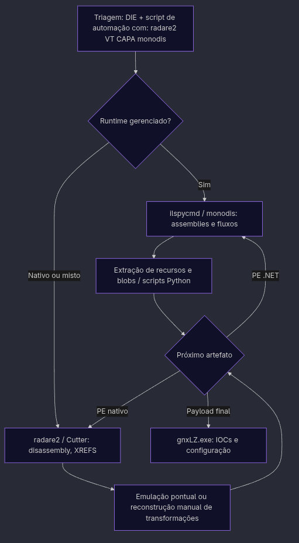


## 3. Desenvolvimento

### 3.1 Visão geral da abordagem, lógica e desafios

O trabalho consistiu em desenrolar a cadeia de forma incremental e totalmente estática (camada a camada, sem executar o payload completo): cada artefato extraído ou reconstruído passou a ser tratado como nova “superfície” de análise, com hashes, triagem de formato e escolha da ferramenta dominante (descompilação .NET versus disassembly nativo). A lógica seguiu o princípio: identificar, no código decompilado ou no disassembly, os pontos em que o malware carrega recursos, decodifica buffers ou invoca `Assembly.Load` / reflexão; a partir desses pivots, extraíram-se blobs brutos (por exemplo com scripts Python e bibliotecas de parsing PE), aplicaram-se as transformações sugeridas pelo fluxo (chaves literais, loops de xor, AES, descompressão) e validou-se o resultado pela assinatura MZ ou pela presença de metadados .NET esperados. Ferramentas como ilspycmd e saídas de monodis deram legibilidade às camadas gerenciadas; radare2 (e, quando conveniente, Cutter) concentraram-se no loader nativo e em rotinas que o IL não cobre; em situações em que a lógica de decodificação era opaca apenas pelo gráfico de fluxo, recorreu-se a emulação pontual de trechos — suficiente para reproduzir o algoritmo sobre o blob, sem colocar o payload final para rodar como processo autônomo num sistema real.

Os desafios principais foram três. Primeiro, a ofuscação e o indireção (indirection) típicos de cadeias .NET (nomes aleatórios, despacho por delegates, dados embutidos em recursos) exigiram correlacionar várias versões do mesmo fluxo até isolar o buffer “certo”. Segundo, a alternância de mundos — módulos gerenciados que desembrulham PE nativo e este que volta a hospedar o CLR — obrigou a mudanças repetidas de ferramenta e a reconstruir cabeçalhos ou alinhamentos quando o blob extraído não era um arquivo válido de primeira. Terceiro, a ausência de execução dinâmica removeu o atalho de inspeção em debugger: toda a confiança na cadeia veio de evidência cruzada (tamanhos, constantes, strings, imports COM/CLR e encadeamento lógico entre estágios).

### 3.2 O arquivo original: Tetris Lite e o arranque do primeiro estágio

O ponto de entrada da amostra é um executável .NET Framework apresentado como “Tetris Lite” para falantes de espanhol: metadados de assembly descrevem um projeto universitário de jogo, com `Main` iniciando o formulário Windows Forms `MenuPrincipal` — isto confere credibilidade social e desvia a atenção de analistas ou usuários que apenas executam o binário. A lógica lúdica existe de fato (por exemplo, o botão “JUGAR” abre o `FormularioJuego`), mas o primeiro estágio malicioso não depende desse clique: dispara durante a construção da interface do menu, misturada com código de criação de labels e buttons. No primeiro momento foi usado o Cutter, com ele foi possível realizar os primeiros mapeamentos, como por exemplo, o recurso RH1:

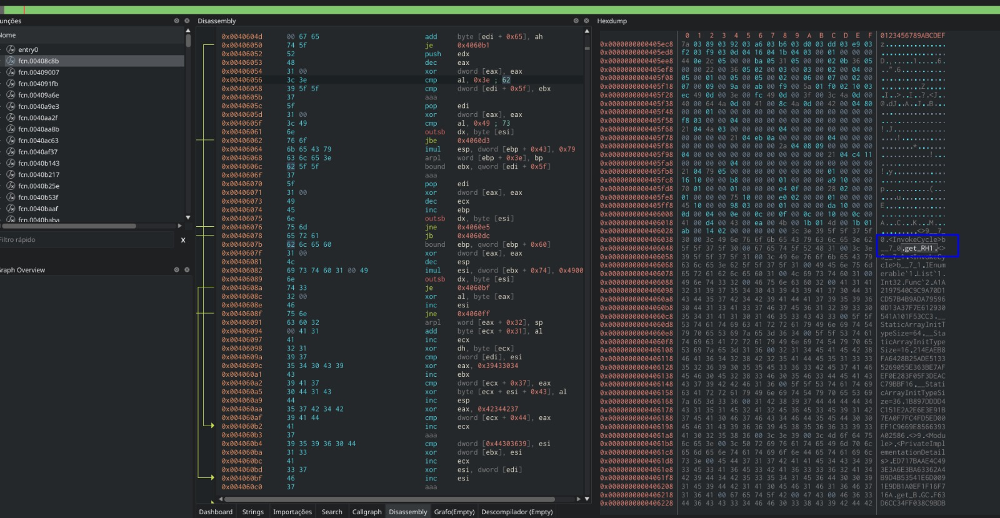

Dois recursos gráficos embutidos, `yHym` e `RH1` (bitmaps em `TetrisLite.Properties.Resources`), funcionam como cofres de dados.

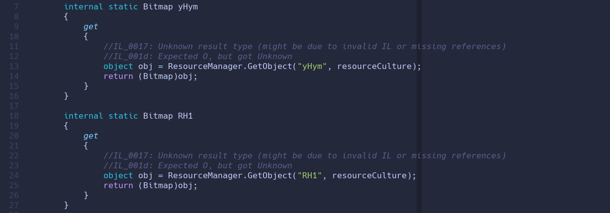

A rotina estática `InvokeCycle` percorre a matriz de pixels de um bitmap e concatena os canais de cor (por exemplo R, G, B) até um limiar de tamanho, técnica alinhada com esteganografia em imagem, na qual o payload não aparece como seção PE óbvia, mas como “ruído” visual.

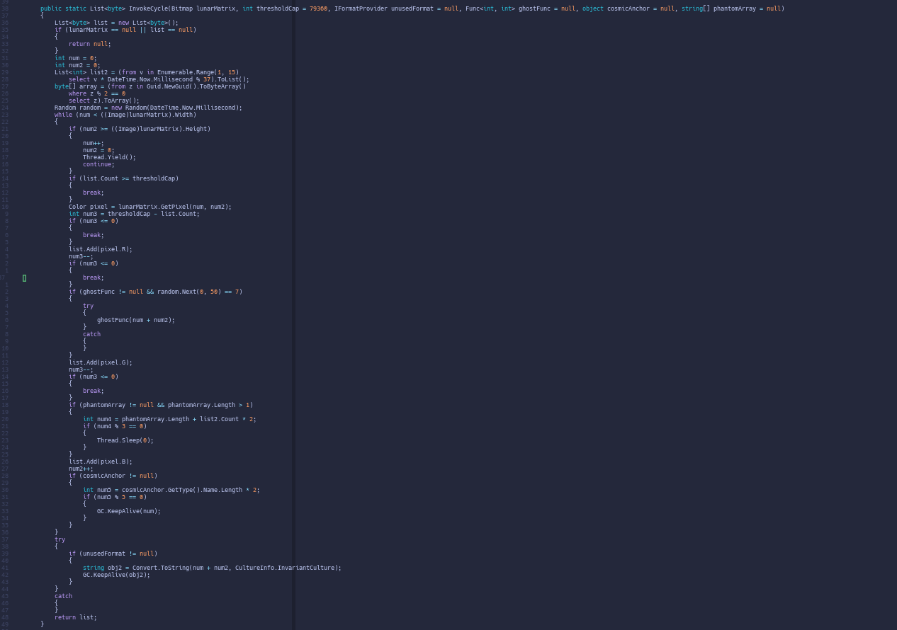

No fluxo observado, um método nomeado de forma enganosa (`SuspendLayout` no projeto decompilado) atribui `pf = InvokeCycle(Resources.RH1).ToArray()`, produzindo um array de bytes que é, de fato, um assembly .NET em memória. Na sequência imediata, o código invoca `Thread.GetDomain().Load(pf)` e, sobre o primeiro tipo exposto pelo assembly carregado, `Activator.CreateInstance`, passando cadeias derivadas do campo `Priority` (partido por `#`) e o nome do assembly legítimo — ou seja, carregamento reflexivo do segundo módulo sem arquivo `.dll` no disco.

Em suma, o conceito-chave deste estágio é a combinação esteganografia + `Load(byte[])` + reflexão: a análise estática seguinte precisou reproduzir `InvokeCycle` sobre o bitmap correspondente a `RH1` para obter o mesmo `pf` que o *runtime* geriria, validando o PE resultante (assinatura `MZ` / metadados .NET) antes de o descompilar com ilspycmd. O recurso `yHym` permanece ligado a estágios posteriores na cadeia, como se verá ao descrever o módulo intermédio.

**Reprodução estática em dois passos.** No projeto descompilado (por exemplo com ilspycmd), o arquivo `TetrisLite.Properties.Resources.resx` agrega os recursos nomeados: cada entrada descreve o tipo e, no caso de imagens, costuma trazer o **payload serializado em Base64** dentro do XML (formato típico de `.resx`). Em vez de descodificar e reconstruir o bitmap manualmente a partir dessas cadeias, usamos um pequeno programa em **C#** com `ResXResourceReader` e `System.Drawing`, compilado e executado com **Mono** em Linux, para ler o `.resx`, instanciar o `Bitmap` e gravá-lo como PNG — assim isolamos `RH1` de forma reprodutível.

```csharp
using System;
using System.Collections;
using System.Drawing;
using System.Resources;

class X {
    static int Main(string[] args) {
        if (args.Length < 3) {
            Console.WriteLine("Uso: extract_rh1.exe <arquivo.resx> <resourceName> <saida.png>");
            return 1;
        }

        string resxPath = args[0];
        string key = args[1];
        string outPath = args[2];

        using (var rr = new ResXResourceReader(resxPath)) {
            foreach (DictionaryEntry e in rr) {
                if ((string)e.Key == key) {
                    var bmp = e.Value as Bitmap;
                    if (bmp == null) {
                        Console.WriteLine("Recurso encontrado, mas não é Bitmap.");
                        return 2;
                    }
                    bmp.Save(outPath, System.Drawing.Imaging.ImageFormat.Png);
                    Console.WriteLine("[+] Extraído: " + outPath);
                    return 0;
                }
            }
        }

        Console.WriteLine("Recurso não encontrado: " + key);
        return 3;
    }
}
```

Compilação e execução (referência de ambiente com Mono; ajuste os caminhos ao projeto descompilado):

```shell
mcs extract_rh1.cs -r:System.Windows.Forms.dll -r:System.Drawing.dll
mono extract_rh1.exe ./TetrisLite.Properties.Resources.resx RH1 RH1.png
```

No **segundo passo**, um *script* em **Python** replica a lógica de `InvokeCycle`: percorre a matriz de pixels na mesma ordem que o código decompilado (aninhamento `x` externo, `y` interno), concatena os canais **R → G → B** por pixel e **corta** o fluxo ao atingir **79360** bytes — o limiar observado no *stub* do Tetris. A saída é o arquivo `pf.bin`, byte a byte alinhado ao que `InvokeCycle(Resources.RH1).ToArray()` produziria em memória.

```python
#!/usr/bin/env python3
from PIL import Image
import sys

if len(sys.argv) < 3:
    print(f"Uso: {sys.argv[0]} <RH1_imagem> <saida_pf.bin> [limite]")
    sys.exit(1)

img_path = sys.argv[1]
out_path = sys.argv[2]
limit = int(sys.argv[3]) if len(sys.argv) > 3 else 79360

img = Image.open(img_path).convert("RGB")
w, h = img.size
pix = img.load()

out = bytearray()
for x in range(w):
    for y in range(h):
        r, g, b = pix[x, y]
        if len(out) < limit:
            out.append(r)
        if len(out) < limit:
            out.append(g)
        if len(out) < limit:
            out.append(b)
        if len(out) >= limit:
            break
    if len(out) >= limit:
        break

with open(out_path, "wb") as f:
    f.write(out)

print(f"[+] Gravado: {out_path} ({len(out)} bytes)")
```

### 3.3 Assembly intermédio (Shaper / `cargaUtil`): do `pf.bin` ao despacho ofuscado

Os bytes que o Tetris obtém a partir de `Resources.RH1` (via `InvokeCycle`) coincidem com o arquivo `pf.bin` (`0748253bb84d8fd3277d926bee9aae97560c37921ccb3d1dbf3199fae3e62a20`) — o mesmo assembly .NET obtido estaticamente pelo **encadeamento** `extract_rh1` (PNG a partir do `.resx`) e *script* Python acima (replicação do limiar de 79360 bytes e da ordem R→G→B por pixel, como em `InvokeCycle`). Gravado em disco, esse módulo foi descompilado com ilspycmd (`-p`) para um projeto que, no relatório da análise, tratamos como `cargaUtil`: metadatos apresentam o produto como “System Shaper” e o nome de assembly como `Shaper`, reutilizando a retórica de “ferramenta de sistema” já anotada nas notas de estágio. O construtor exposto no estágio anterior instancia `Shaper26.GameForm`, passando os mesmos argumentos de cadeia que o menu do Tetris preparou, assim, o segundo estágio permanece acoplado ao primário por reflexão, mas já troca a peça de branding (jogo versus “shaper”).

O código deste assembly é densamente ofuscado: classes e métodos com identificadores aleatórios, módulo de arranque e fluxos em máquina de estados no `GameForm`, delegates para APIs nativas e rotinas criptográficas (por exemplo AES/Rijndael com chaves e IV materializados em literais). Um pivô decisivo para o estágio seguinte é o acesso a `GetManifestResourceStream` sobre um recurso com nome ofuscado (`g7Q2TXBhiyx9h5cbgd.rkgyafqCc3HAAWk97y`): o stream é lido na totalidade e submetido a uma transformação aritmética por blocos (estilo PRNG/mix de words seguido de reescrita de bytes), produzindo um mapa token→deslocamento usado para repor campos estáticos via reflexão — isto implementa uma forma de proteção / “reparação” de metadados em tempo de carga, típica de packers .NET, e explica por que a leitura ingênua do IL nem sempre reflete, à primeira vista, o grafo real de dependências.

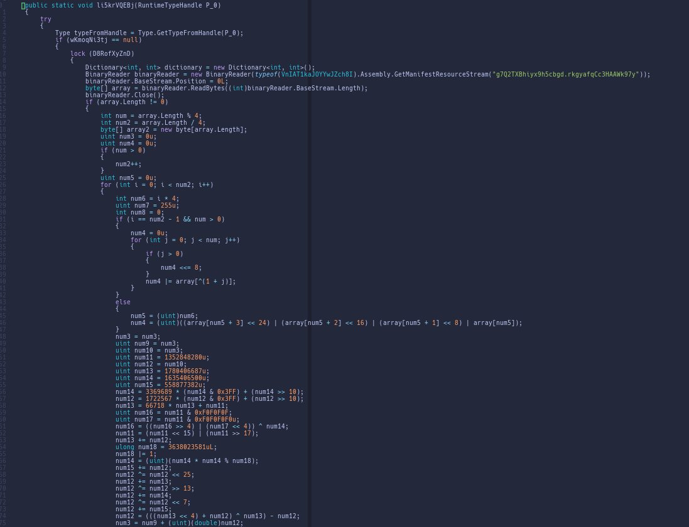
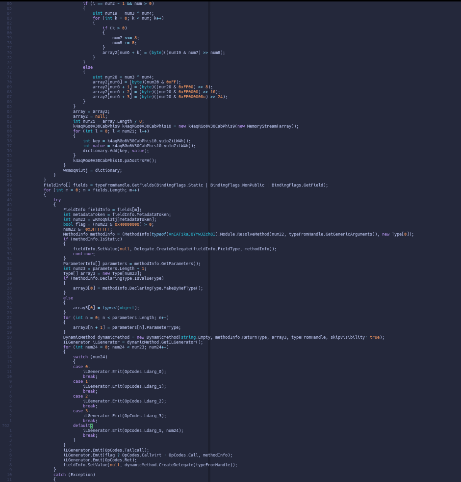

Do ponto de vista da cadeia, este nível consome o `pf` gerado pelo estágio base e prepara blobs internos a partir de recursos embutidos; o passo imediato da investigação, tratado no parágrafo seguinte, consiste em extrair e interpretar o PE .NET seguinte — identificado nesta cadeia como `DriverFixPro.dll` — que o Shaper mantém encapsulado e trata como próxima camada executável.

### 3.4 `DriverFixPro.dll`: do bitmap `yHym` ao PE nativo embutido

Com o mapa de delegates reconstituído a partir do recurso `g7Q2…` (cf. §3.3, método `Justy`), torna-se legível o núcleo desse método no Shaper:

```csharp
// função Justy 
P_0 = PGsJ1PJTp(P_0);                    // hex -> string
P_1 = Kx78QUc56(P_1);                    // hex -> string
fqYr4T3An(vQhNwk0cl(                      // invoke(Assembly.Load(...))
    Mist(
        YCyKuN2sN(SSStAx4Mk(P_0, P_2)),   // bitmap -> bytes
        P_1                               // chave
    )
));
```

os parâmetros hexadecimais herdados do Tetris são convertidos em cadeias, obtém-se um bitmap via `ResourceManager` sobre o assembly `TetrisLite` (caminho que resolve o recurso `yHym`), os pixels são serializados para bytes e o buffer passa pela rotina `Mist` (XOR com materialização da chave em Unicode big-endian). Aqui vigora um detalhe de implementação decisivo para a reprodutibilidade estática: o avanço circular da chave indexa pelo comprimento da string `P_1`, não pelo comprimento em bytes da chave expandida, omitir esta nuance produz PE corrompido (MZ inconsistente, infelizmente levei um certo tempo para ver esse detalhe). Após `Mist`, o fluxo invoca `Assembly.Load` sobre o resultado, materializando o terceiro grande módulo .NET, aqui denominado `DriverFixPro.dll` (`4b042dda59d23c13ecbd249824c4e58bd1a4350a7d16dcef709e4211f096c5fe`). Assim, `RH1` alimenta o Shaper (`pf`), enquanto `yHym` alimenta o DriverFixPro: o trecho sobre `g7Q2…` em §3.3 restringe-se ao primeiro salto reflexivo; o `yHym` volta ao centro da narrativa nesta transição.

O `DriverFixPro.dll` mantém a fachada de utilitário (“driver” / otimização) e, no interior, encapsula um blob cifrado endereçado por metadados de recurso. Na documentação de IOCs, o nome lógico do recurso aparece como `g6j0DgxW6G` e a chave associada à rotina de decodificação como `ZhxKjevgGpoBF` — constantes extraídas estaticamente do código descompilado. A decifração em lote gera um executável PE32 nativo (i386), arquivo que consolidamos como `DriverFixPro_embedded_decrypted_patchedMZ.bin` (`d067d42da87936927b008121667f8b3f554f2ce06a472835fcfca60b57a678f1`), após correção pontual do cabeçalho MZ/PE quando o dump bruto ainda não era analisável. A triagem deste binário aponta para hospedagem CLR via COM (`mscoree.dll`, `CLRCreateInstance`, interfaces `ICLRMetaHost` / `ICLRRuntimeInfo` / `ICorRuntimeHost`, load de assembly a partir de array de bytes e invocação do entrypoint gerenciado), ou seja, um loader nativo cuja função é reintroduzir o mundo .NET em memória. Esse é o conceito-chave que liga este parágrafo ao seguinte: o parágrafo seguinte tratará do assembly .NET mínimo que este host CLR desbloqueia, antes de chegar ao `gnxLZ.exe`. 


### 3.5 O assembly .NET mínimo (stage 4): recurso `___`, zlib e handlers de resolução

O binário nativo `DriverFixPro_embedded_decrypted_patchedMZ.bin` não é o stealer final: após a sequência COM descrita no parágrafo d, o runtime gerenciado recebe um array de bytes correspondente a um assembly .NET compactado e escondido na seção de recursos (alta entropia em `.rsrc`). Para reproduzi-lo fora do processo malicioso, seguimos o método: mapear a imagem PE do loader, emular pontualmente rotinas nativas que inicializam um contexto de transformação (`fcn.00401300`) e aplicam um descodificador por blocos (`fcn.00401560`, chunks de `0x400`) sobre o recurso manifestado como `___`. O buffer resultante foi gravado como `stage4_resource_decoded.bin` (`af5a3cd165b8ae6f02094299573f38892b207ed5bddff2bc69278c5f0e8295ba`). Ou seja,

A cadência seguinte espelha o `main` nativo antes da construção do `SAFEARRAY` para o CLR: a partir do quarto byte, aplica-se descompressão zlib ao stream decodificado, produzindo o que chamamos de `stage4_resource_inflated.bin`; em seguida remove-se um prefixo de `0x0E` bytes, operação que o loader efetua sobre o payload inflado. O artefato consolidado foi denominado `stage4_managed_assembly.bin` (`4db85e479a54fc02b67f8d9ae565cfe8c4d693fb9681b68ddce93ba0900dc146`), validável estaticamente por assinatura `MZ`, cabeçalho CLI (`BSJB`) e classificação como PE32 / assembly .NET. A decompilação com ilspycmd revela um módulo enxuto (da ordem de cinco métodos), cujo papel é sobretudo resolver e carregar o próximo binário: observam-se hooks do tipo `AssemblyResolve` / `ResourceResolve` no AppDomain — padrão típico de stagers gerenciados que atrasam a exposição do PE final até momentos de carga.

1. mapeia o PE do loader nativo em memória (imagem PE mapeada).
2. emula `fcn.00401300` (init do contexto de transformação).
3. emula `fcn.00401560` em chunks de `0x400` sobre o recurso `___`.
4. obtém stream decodificado e aplica `zlib.decompress` em `offset +4`.
5. aplica `skip 0x0E` no buffer inflado (mesmo comportamento do `main` antes do `SAFEARRAY`).
6. grava `stage4_managed_assembly.bin`.
7. extrai o recurso manifesto `_` desse assembly, resultando no payload final referido neste artigo como `gnxLZ.exe` (o mesmo conteúdo pode ser salvo em disco com outro nome descritivo, por exemplo `stage4_manifest_resource__.bin` — mesmo SHA256; só muda a convenção de nomenclatura).


Abrindo o DriverFixPro_embedded_decrypted_patchedMZ.bin no Cutter e navegando até a função `fcn.00401300`, vemos:


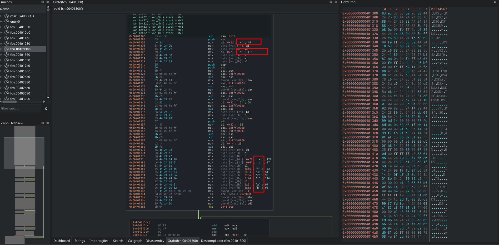

Que ela reserva stack frame, grava literais (caracteres como -, s, x, a, f, 3, Z, etc.) e sobretudo calcula ponteiros com o padrão 0xFFFE000x - ESI, onde ESI = ECX (o ponteiro do contexto passado pelo chamador). Isto materializa, na prática, deslocamentos fixos relativos ao bloco de estado usado pela segunda função, típico de código gerado/ofuscado que trata o contexto como um “objeto” plano em memória. Não é necessário renomear cada campo; basta reconhecer que ECX aponta para o estado mutável consumido pelo decodificador, e que esta rotina prepara tabelas/metadados internos antes do laço de blocos.

Analisando a função `fcn.00401560`, vemos:

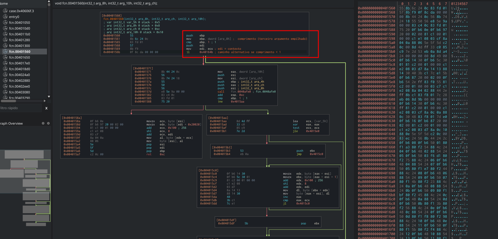

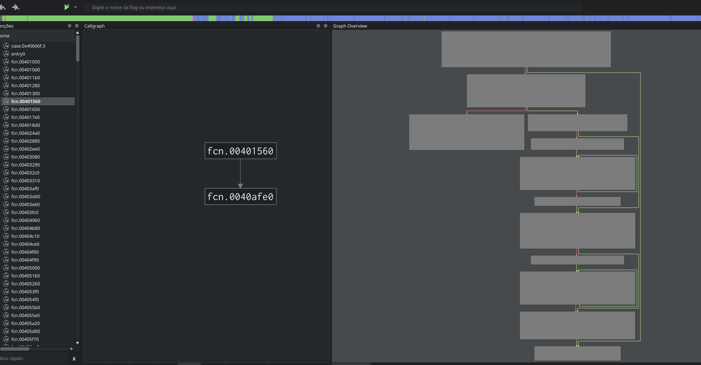

Segue-se uma chamada a 0x0040AFE0 com três argumentos empilhados — pela ordem dos push, trata-se de memcpy ou equivalente (dest, src, n) para copiar o bloco atual para a zona de trabalho. Basicamente, essa função tem dois modos:

- Bloco de tamanho 1 (ebp == 1): lê um byte da origem, indexa uma tabela grande em [edi + 0x20020] (via ecx expandido com +0x100 e << 8), e reescreve o byte na origem (mov [esi], al).
- Blocos maiores: laço em pares de bytes (0x4015c0...0x4015dd) que combina novamente índices de 16 bits (+0x100, << 8) com lookup em memória apontada por edi, escrevendo de volta no buffer.

Há ainda um estágio final com xor al, 0x55 sobre um byte derivado da tabela (0x4015e0 em diante no fluxo), ou seja, camada adicional de mistura depois dos lookups.

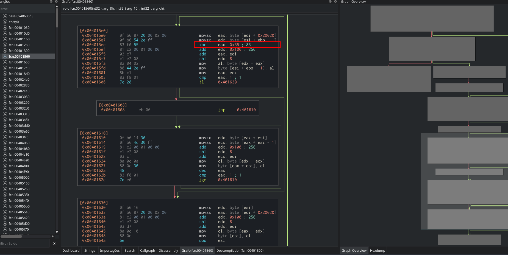

Portanto, trata-se de um esquema de substituição/permutação orientado a tabelas (com forte semelhança a custom stream cipher ou packer genérico), dependente do contexto inicializado em 0x00401300. Daí a necessidade de emulação fiel (Unicorn) ou de reimplementação exata: qualquer atalho que não reproduza escritas na estrutura edi+... falha silenciosamente. Nesse caso, tentei colocar um pouco mais de detalhe, pois não foi trivial entender esse fluxo. Por fim, o recurso `_` extraído do `stage4_managed_assembly.bin` é um PE32 .NET (x86) — o mesmo conteúdo do passo 7 acima, independentemente de o arquivo no disco se chamar `gnxLZ.exe` ou, por convenção de extração, `stage4_manifest_resource__.bin` — alinhado aos campos estáticos `StartupInstallationName` / `StartupRegName` / `StartupDirectoryName` no módulo de configuração `QI3.MXudRA` (`gnxLZ.exe`, `gnxLZ`, pasta sob `%AppData%`). Trata-se do último estágio funcional observado nesta cadeia: já não há um `Assembly.Load(byte[])` evidente que introduza outro PE; em vez disso, o entrypoint gerenciado prepara o ambiente de rede (`ServicePointManager.SecurityProtocol`, callback de certificado TLS que aceita sempre o servidor) e delega a orquestração a `QI3.KsQeXu.vEmlKd2X()`, mantendo a aplicação viva com `Application.Run()`.

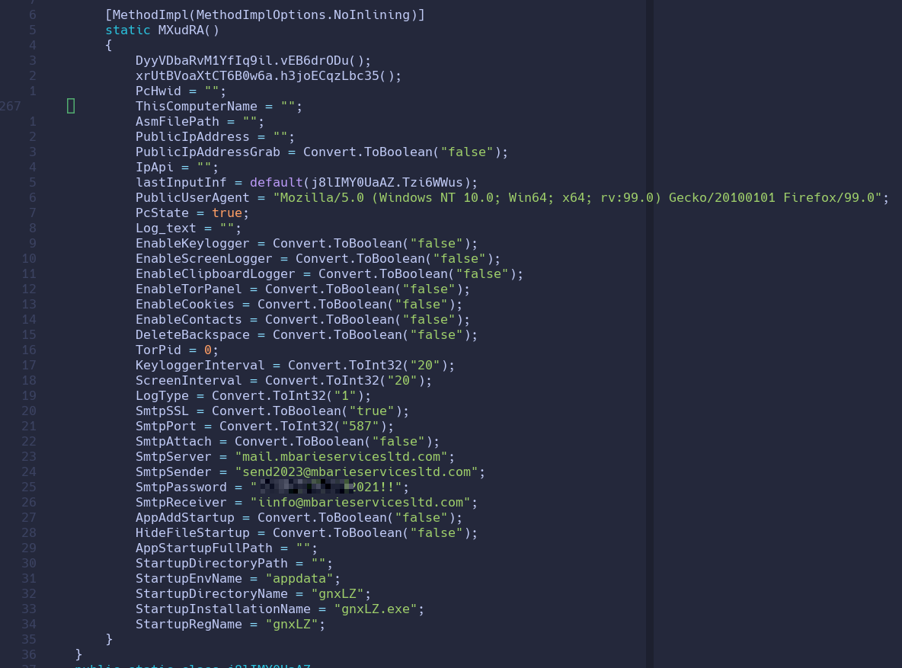

A exfiltração está configurada em claro no mesmo bloco de configuração: servidor SMTP `mail[.]mbarieservicesltd[.]com`, remetente `send2023@mbarieservicesltd[.]com`, destinatário `iinfo@mbarieservicesltd[.]com`, porta 587, SSL ativo e credencial associada (valor reproduzido integralmente nos IOCs infra). Por indícios estáticos (APIs, nomes de tipos e fluxos decompilados onde visíveis), o módulo agrega capacidades típicas de infostealer / Agent Tesla: keylogger e temporizadores, monitoramento da área de transferência (`SetClipboardViewer` / `ChangeClipboardChain`), captura de tela (`CopyFromScreen`), coleta de cookies e listas de navegadores Chromium/Mozilla, uso de Windows Vault, além de verificações anti-análise (`CheckRemoteDebuggerPresent`, `GetLastInputInfo`, entre outras). Grande parte do corpo lógico permanece ofuscada: o binário embute um recurso interno (`WMfXD5GcX1MgIGZZMb.kXVrRgk44JKN3CsPgv`) processado por rotinas que decodificam e patcheiam delegados em memória — daí métodos aparentemente vazios no IL descompilado sem seguir essa segunda fase.

Em síntese, o conceito-chave do fecho da cadeia é “configuração legível + comportamento sensível escondido atrás de virtualização em recurso”: a análise estática entrega IOCs de arquivo e de infraestrutura com rigor, mas a equipe de resposta deve assumir que lógica adicional só seria totalmente confirmável com instrumentação dinâmica controlada — aqui deliberadamente evitada. O enquadramento como Agent Tesla (ou família próxima de information stealer .NET) baseia-se na sobreposição de TTPs com o software [S0331](https://attack.mitre.org/software/S0331/) da MITRE (roubo de credenciais de aplicações, captura de keystrokes, exfiltração por e-mail).


## 4. Indicadores de comprometimento (IOCs)

### 4.1. Cadeia de arquivos (SHA256)

| Ordem | Artefato (rótulo usado neste artigo) | SHA256 |
|------|--------------------------------|--------|
| 1 | `agentTesla.exe` (dropper Tetris) | `1802fc33f4ace43af977ed8e064c4e6154d23c1f5c737b139ce87a9e9f1a0fa6` |
| 2 | `pf.bin` (Shaper extraído de `RH1`) | `0748253bb84d8fd3277d926bee9aae97560c37921ccb3d1dbf3199fae3e62a20` |
| 3 | `DriverFixPro.dll` | `4b042dda59d23c13ecbd249824c4e58bd1a4350a7d16dcef709e4211f096c5fe` |
| 4 | `DriverFixPro_embedded_enc.bin` (blob cifrado embutido) | `74e91971b71b81e7aebdc24d2839822895e8ec120856751a68e335d1a55b8826` |
| 5 | `DriverFixPro_embedded_decrypted_patchedMZ.bin` (loader nativo CLR) | `d067d42da87936927b008121667f8b3f554f2ce06a472835fcfca60b57a678f1` |
| 6 | `stage4_resource_decoded.bin` (pós `fcn.00401560` sobre `___`) | `af5a3cd165b8ae6f02094299573f38892b207ed5bddff2bc69278c5f0e8295ba` |
| 7 | `stage4_resource_inflated.bin` (pós zlib) | `935f629813c9b5a5a9a85d90315a28c7f119b8c747569051d6ed125de552fe39` |
| 8 | `stage4_managed_assembly.bin` (stub .NET) | `4db85e479a54fc02b67f8d9ae565cfe8c4d693fb9681b68ddce93ba0900dc146` |
| 9 | `gnxLZ.exe` (recurso manifesto `_` extraído de `stage4_managed_assembly.bin`; o mesmo blob pode ser salvo com outro nome, por exemplo `stage4_manifest_resource__.bin`, mesmo SHA256) | `6f25b64efa6c3595eccd87c8c3a1f5265950b3f64bdcde882338ad9d84712f02` |
| — | Recurso interno de proteção `WMfXD5GcX1MgIGZZMb.kXVrRgk44JKN3CsPgv` | `cfe2105b186c41b76654985fc6932983cfacece0621ea4e5a08d3d3d604347f2` |

Fluxo alinhado à coluna Ordem da tabela acima (1→9). O recurso `WMf…` (linha separada na tabela) é embutido no estágio final, não um elo serial adicional.


### 4.2. Infraestrutura e exfiltração (SMTP)

Valores observados estaticamente em `QI3.MXudRA` (estágio final):

| Tipo | Valor |
|------|--------|
| Servidor SMTP | `mail[.]mbarieservicesltd[.]com` |
| Remetente | `send2023@mbarieservicesltd[.]com` |
| Destinatário | `iinfo@mbarieservicesltd[.]com` |
| Porta | `587` |
| SSL | `true` |


### 4.3. Persistência e artefatos locais (configuração estática)

| Parâmetro | Valor |
|-----------|--------|
| `StartupEnvName` | `appdata` |
| `StartupDirectoryName` | `gnxLZ` |
| `StartupInstallationName` | `gnxLZ.exe` |
| `StartupRegName` | `gnxLZ` |

---

## 5. Conclusão

Este artigo descreveu, de ponta a ponta, a engenharia reversa usando somente a análise estática de uma cadeia associada ao ecossistema Agent Tesla, partindo de um dropper disfarçado de jogo (Tetris) até o payload final `gnxLZ.exe`, com documentação de IOCs (hashes, SMTP, nomes de persistência). A contribuição principal é mostrar que é possível reconstituir a sequência de transformações — esteganografia em bitmap, `Assembly.Load` reflexivo, tabela de delegates em recurso, `Mist` com detalhe de encoding, PE nativo com hospedagem CLR via COM, pipeline `___` → zlib → skip → stub .NET → recurso `_` — sem depender de sandbox dinâmica para explicar a linha de delivery.

As limitações são inerentes ao método: grande parte da lógica do estágio final permanece atrás de proteção em recurso e runtime patching; portanto, embora configuração e infraestrutura de exfiltração tenham sido extraídas com clareza, comportamento fino (frequência de envio, formato exato dos relatórios, ramos condicionais) pode exigir validação dinâmica isolada como trabalho futuro. Para a comunidade de defesa, os artefatos descritos na Seção 4 permitem bloqueio e correlação com outras amostras da mesma família.

## 6. Referências 

1. MITRE ATT&CK. Agent Tesla. Software S0331. [https://attack.mitre.org/software/S0331/](https://attack.mitre.org/software/S0331/)
2. Microsoft Learn. PE Format. [https://learn.microsoft.com/en-us/windows/win32/debug/pe-format](https://learn.microsoft.com/en-us/windows/win32/debug/pe-format)
3. Microsoft Learn. .NET assembly file format. [https://learn.microsoft.com/en-us/dotnet/standard/assembly/file-format](https://learn.microsoft.com/en-us/dotnet/standard/assembly/file-format)
4. ILSpy / ilspycmd. [https://github.com/icsharpcode/ILSpy](https://github.com/icsharpcode/ILSpy)
5. Detect It Easy (DIE). [https://github.com/horsicq/Detect-It-Easy](https://github.com/horsicq/Detect-It-Easy)
6. Cutter (interface ao ecossistema Rizin/radare2). [https://github.com/rizinorg/cutter](https://github.com/rizinorg/cutter)
7. radare2 — framework de engenharia reversa. [https://github.com/radareorg/radare2](https://github.com/radareorg/radare2)
8. Unicorn — motor de emulação de CPU útil para reproduzir trechos nativos. [https://www.unicorn-engine.org/](https://www.unicorn-engine.org/)
9. Eusser, S. et al. (coord.). CAPA — the FLARE team’s open-source tool to identify capabilities in executable files. Projeto mandiant/capa. [https://github.com/mandiant/capa](https://github.com/mandiant/capa)
10. pefile (Python) — análise estrutural de PE. [https://github.com/erocarrera/pefile](https://github.com/erocarrera/pefile)
11. RFC 1950 / RFC 1951 — formato zlib / DEFLATE (relevante para o passo de descompressão do stage 4). [https://www.rfc-editor.org/rfc/rfc1950](https://www.rfc-editor.org/rfc/rfc1950) · [https://www.rfc-editor.org/rfc/rfc1951](https://www.rfc-editor.org/rfc/rfc1951)
12. Microsoft Learn. CLR Hosting. Visão geral das interfaces de hospedagem do runtime (.NET Framework). [https://learn.microsoft.com/en-us/dotnet/framework/unmanaged-api/hosting/](https://learn.microsoft.com/en-us/dotnet/framework/unmanaged-api/hosting/)
13. MAoS – Malware Analysis on Steroids book released. [MAoS - Malware Analysis on Steroids: Fighting Malware to the Death - Real-World Threats and Reverse Engineering Tactics](https://www.amazon.com/dp/B0FQDGZGZW).
14. https://www.youtube.com/watch?v=ZKgLnw55Ymk [Mente Binária - CR2](https://www.youtube.com/watch?v=ZKgLnw55Ymk)
