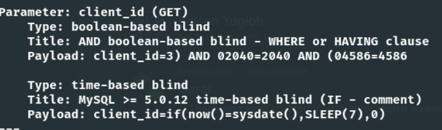

# SQL Injection Time-Based Blind

## Introdução

Nesta análise, mostro uma falha de segurança que encontrei em uma API de um programa privado de bug bounty, na Bug Hunt. Por questões de confidencialidade, o nome da empresa e outras informações que possam levar ao seu reconhecimento serão omitidos. O objetivo deste artigo é compartilhar insights com outros pesquisadores e interessados no tema, visto que muitos artigos que consultei anteriormente me ajudaram a aprimorar minhas técnicas de invasão. Espero que este conteúdo também possa ser útil para outros.

Após várias semanas de foco no programa da empresa, consegui identificar uma URL de uma API vulnerável (utilizei o Katana como ferramenta de suporte, as aulas do Ofjaaah deram vários insights). Após diversas análises e enumerações manualmente, descobri que a API não possuía as devidas proteções (como por exemplo, WAF). Então, coloquei a automação em prática, para realizar a enumeração da API de maneira mais acertiva, empreguei ferramentas como ffuf, feroxbuster e kiterunner. Após um tempo considerável, encontrei um endpoint que se configurava como um vetor de ataque, ou seja, possibilitando um ataque de SQL Injection. Com o auxílio do sqlmap, consegui identificar a vulnerabilidade e extrair informações do banco de dados.

O **SQL Injection Time-Based Blind** é um tipo de ataque de injeção de SQL que manipula consultas ao banco de dados de uma aplicação. Neste caso específico, trata-se de uma variação do **Blind SQL Injection**, onde não é possível obter diretamente o conteúdo do banco de dados, mas sim inferir informações com base no tempo de resposta da aplicação. A técnica envolve a construção de uma consulta SQL maliciosa que faz com que o banco de dados "espere" um determinado período antes de retornar uma resposta. A partir do tempo que a aplicação leva para responder, é possível determinar se a consulta foi verdadeira ou falsa. Por exemplo, ao passar a seguinte query para o parâmetro vulnerável:

```sql
if(now()=sysdate(),SLEEP(7),0)
```

Se a condição for verdadeira, o banco de dados irá pausar a execução por 7 segundos antes de retornar uma resposta. Caso contrário, se a condição for falsa, o banco de dados retornará imediatamente, sem atraso.

## Desenvolvimento

Tudo começa com a enumeração bem feita, esse processo é de suma importância, anote tudo que foi realizado e todas as informações coletadas. Pois, em algum momento esses dados irão fazer a total diferença, por exemplo, só com essa enumeração consegui outro bounty crítico por vazamento de dados. Irei pular essa parte de enumeração e vou direto a vulnerabilidade.
Como a API não estava protegida por um **Web Application Firewall (WAF)**, optei por utilizar o sqlmap na URL que apontei como vulnerável, a qual tinha a seguinte estrutura:

```sql
https://[api]/path?parametro=666
```

A intenção aqui era verificar a vulnerabilidade e a possibilidade de enumerar o banco de dados.

```shell
sqlmap --url https://[api]?parametro=666 --dbs -p parametro --time-sec=7
```

Antes de analisarmos parte do resultado, vamos entender melhor este comando:

- **`--dbs`**: Este parâmetro instrui o sqlmap a tentar enumerar os bancos de dados disponíveis no servidor de banco de dados em teste. Ele tentará descobrir quais bancos estão presentes na aplicação.

- **`-p parametro`**: Este parâmetro especifica qual parâmetro deve ser testado para injeção SQL. Neste caso, o parâmetro `parametro` da URL está sendo alvo da injeção.

- **`--time-sec=7`**: Este parâmetro define o tempo que o sqlmap deve esperar (em segundos) ao testar injeções SQL baseadas em tempo. Se a resposta do servidor demorar 7 segundos ou mais, isso indicará que a injeção SQL foi bem-sucedida.

Esse tipo de ataque requer uma conexão estável com a internet. No caso, 7 segundos foi o tempo ideal que encontrei, considerando a minha conexão.

Assim, a primeira etapa foi concluída: a URL estava vulnerável. Conforme é possível ver no print:



Após a confirmação, utilizei as informações obtidas, como o nome do banco de dados, para verificar se não se tratava de um falso positivo. Em um novo terminal, iniciei uma nova enumeração, esse processo pode ser demorado (para quem já lidou com esse tipo de vulnerabilidade acho que me entende). Comecei a enumerar as tabelas:

```shell
sqlmap -u "https://[api]?parametro=666" --time-sec=7 -D NOME_DATABASE --tables
```

Assim que obtive o primeiro resultado, abri outro terminal para enumerar as colunas da tabela em questão:

```shell
sqlmap -u "https://[api]?parametro=666" --time-sec=7 -D NOME_DATABASE -T NOME_TABELA --columns
```

Em seguida, comecei a enumerar os valores das colunas:

```shell
sqlmap -u "https://[api]?parametro=666" --time-sec=7 -D NOME_DATABASE -T NOME_TABELA -C NOME_COLUNA_1,NOME_COLUNA_2,NOME_COLUNA_3 --dump
```

Essas enumerações foram necessárias para demonstrar o impacto da vulnerabilidade e confirmar que os dados eram, de fato, da empresa em questão.

## Referências

1. [Explicação e exemplos de SQL Injection](https://book.hacktricks.xyz/pentesting-web/sql-injection)
2. [Exemplos do site do PortSwigger sobre SQL Injection](https://portswigger.net/web-security/sql-injection/cheat-sheet)
3. [GitHub com vários exemplos de payloads](https://github.com/swisskyrepo/PayloadsAllTheThings/tree/master/SQL%20Injection)
4. [Mais exemplos de SQL Injection](https://crashtest-security.com/sql-injection-union/)
5. [Lista de payloads para SQL Injection](https://github.com/payloadbox/sql-injection-payload-list)
