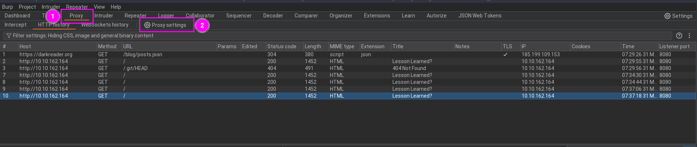
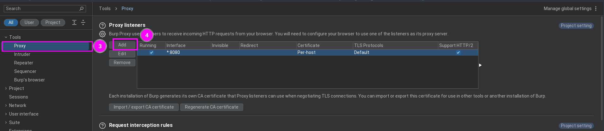
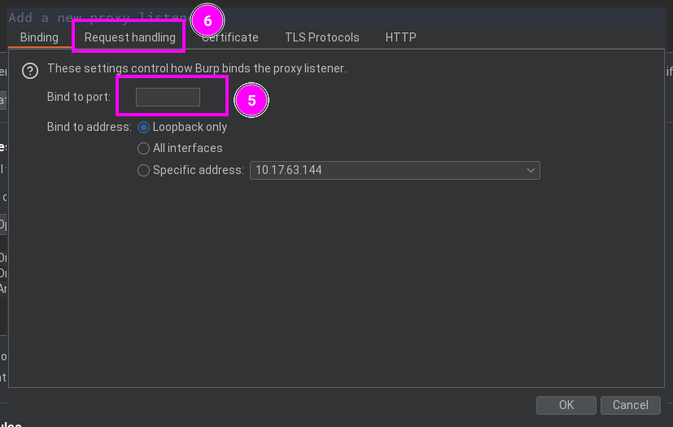
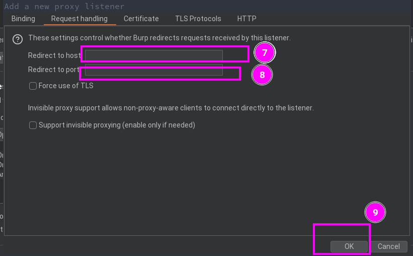
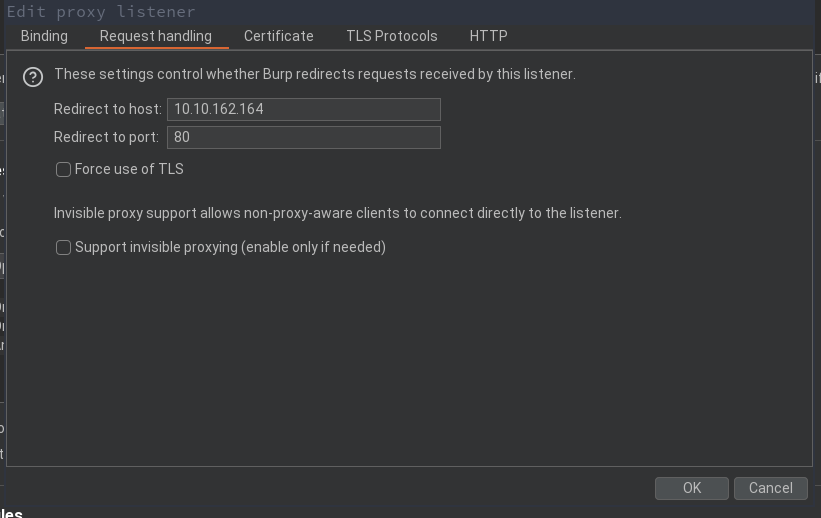
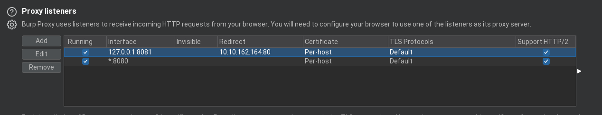
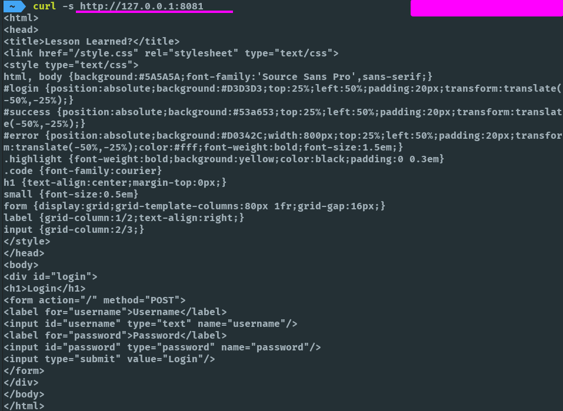

# Redirecionando o Tráfego para o Burp Suite

Neste tutorial, vamos aprender a redirecionar o tráfego de uma interface para o Burp Suite, o que pode ser extremamente útil para estudantes e pesquisadores que desejam analisar cada requisição de maneira detalhada. Esta técnica é especialmente valiosa em cenários de estudo, pentests, ou bug bounties, onde é crucial compreender as interações entre ferramentas como **sqlmap** ou scripts personalizados com uma página web. Ao configurar o Burp Suite para capturar esses dados, você poderá obter insights profundos sobre o comportamento dessas interações, permitindo uma análise mais precisa e detalhada.

Siga os passos abaixo para configurar essa funcionalidade.

## Passo 1: Configuração Inicial do Burp Suite

1. Abra o Burp Suite e navegue até o menu **Proxy** (1) e depois selecione a opção **Proxy settings** (2).

2. Na janela que se abrirá, verifique se a opção **Proxy** (3) está selecionada. Em seguida, clique em **Add** (4) para adicionar uma nova configuração nos **Proxy Listeners**.

## Passo 2: Configuração do Proxy Listener

1. Na janela de configuração do proxy listener, na opção **Bind to port** (5), defina a porta como 8081. 
2. Depois, vá para o menu **Request handling** (6) para configurar o redirecionamento de tráfego.

## Passo 3: Configuração do Redirecionamento

1. Em **Redirect to host** (7), insira o IP da aplicação que será testada.
2. Em **Redirect to port** (8), coloque a porta usada pelo serviço web da aplicação, geralmente a porta padrão para HTTP é 80.
3. Após essas configurações, clique em **OK** (9).

Seu Burp Suite deve estar configurado da seguinte forma:

## Passo 4: Seleção da Regra Criada

1. Selecione a regra que você criou para garantir que o redirecionamento funcione corretamente.

Observe que a interface usada é `127.0.0.1` na porta `8081`. Portanto, para enviar a requisição para o Burp Suite, será necessário utilizar essa interface e porta.

## Passo 5: Testando a Configuração

1. Com a configuração feita, vamos testar usando um comando `curl` para fazer uma requisição GET.

2. No Burp Suite, você pode acompanhar as requisições pelo **Logger** e pelo **HTTP History**.

Você também pode usar o **Intruder** para modificar as requisições, aproveitando todas as funcionalidades do Burp Suite para análise e teste.
